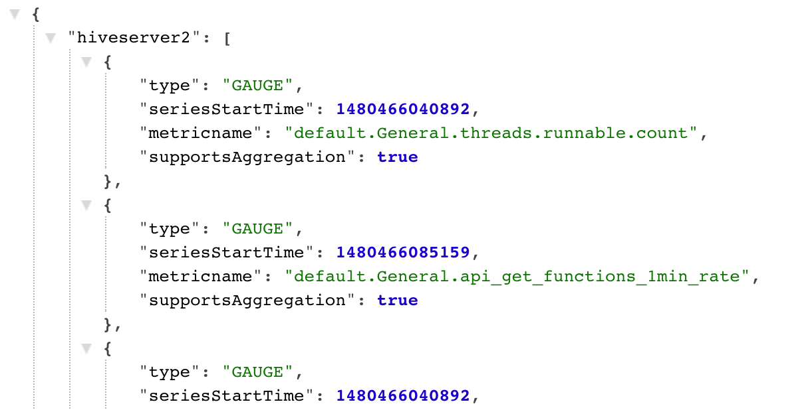
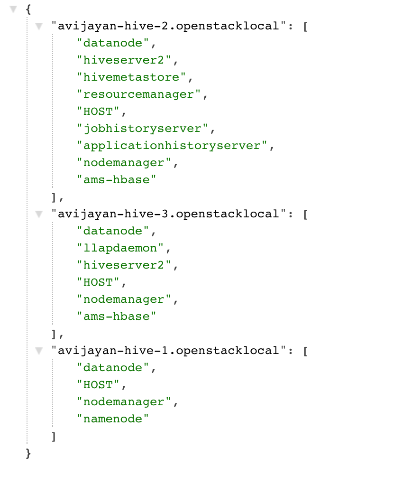
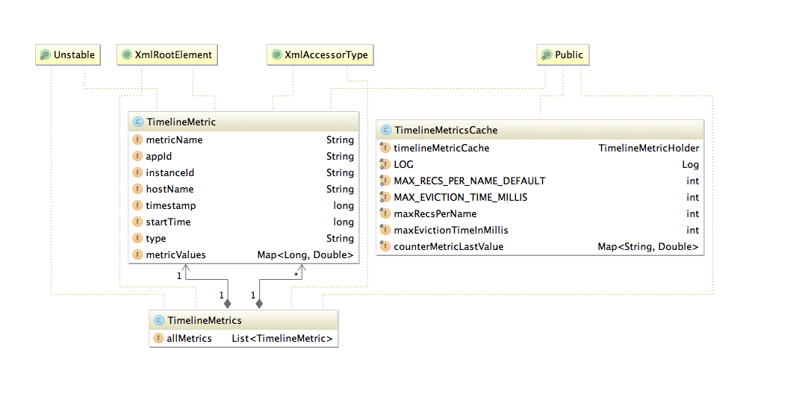

# Metrics Collector API Specification

## Sending Metrics to AMS (POST)

Sending metrics to Ambari Metrics Service can be achieved through the following API call.

The Sink implementations responsible for sending metrics to AMS, buffer data for 1 minute before sending. TimelineMetricCache provides a simple cache implementation to achieve this behavior.

Sample sink implementation use by Hadoop daemons: https://github.com/apache/ambari/tree/trunk/ambari-metrics/ambari-metrics-hadoop-sink

```uri
POST http://<ambari-metrics-collector>:6188/ws/v1/timeline/metrics
```

```json
{
  "metrics": [
    {
      "metricname": "AMBARI_METRICS.SmokeTest.FakeMetric",
      "appid": "amssmoketestfake",
      "hostname": "ambari20-5.c.pramod-thangali.internal",
      "timestamp": 1432075898000,
      "starttime": 1432075898000,
      "metrics": {
        "1432075898000": 0.963781711428,
        "1432075899000": 1432075898000
      }
    }
  ]
}
```

```
Connecting (POST) to <ambari-metrics-collector>:6188/ws/v1/timeline/metrics/
Http response: 200 OK
```

## Fetching Metrics from AMS (GET)

**Sample call**
```
GET http://<ambari-metrics-collector>:6188/ws/v1/timeline/metrics?metricNames=AMBARI_METRICS.SmokeTest.FakeMetric&appId=amssmoketestfake&hostname=<hostname>&precision=seconds&startTime=1432075838000&endTime=1432075959000
Http response: 200 OK
Http data:
{
   "metrics": [
      {
         "timestamp": 1432075898089,
         "metricname": "AMBARI_METRICS.SmokeTest.FakeMetric",
         "appid": "amssmoketestfake",
         "hostname": "ambari20-5.c.pramod-thangali.internal",
         "starttime": 1432075898000,
         "metrics": {
            "1432075898000": 0.963781711428,
            "1432075899000": 1432075898000
         }
      }
   ]
}
```

**Generic GET call format**
```uri
http://<AMS_HOST>:6188/ws/v1/timeline/metrics?metricNames=<>&hostname=<>&appId=<>&startTime=<>&endTime=<>&precision=<>
```

**Query Parameters Explanation**

Parameter|Optional/Mandatory|Explanation|Values it can take
---------|------------------|-----------|-------------------
metricNames | Mandatory Comma | separated list of metrics that are required. | disk_free,mem_free... etc
appId | Mandatory |The AppId that corresponds to the metricNames that were requested. Currently, only 1 AppId is required and allowed. | HOST/namenode/datanode/nimbus/hbase/kafka_broker/FLUME_HANDLER etc
hostname | Optional | Comma separated list of hostnames. When no specified, cluster aggregates are returned. | h1,h2..etc
startTime, endTime  | Optional | Start and End time values. If not specified, the last data point of the metric is returned. | epoch times in seconds or milliseconds
precision | Optional | What precision the data needs to be returned. If not specified, the precision is calculated based on the time range requested (Table below) |SECONDS/MINUTES/DAYS/HOURS

**Precision query parameter (Default resolution)**

  <table class="confluenceTable">
   <colgroup>
    <col />
    <col />
    <col />
   </colgroup>
   <tbody>
    <tr>
     <th class="confluenceTh"><p><span>Query Time</span></p><p><span>range</span></p></th>
     <th class="confluenceTh"><p><span>Resolution of </span><span>returned metrics</span></p></th>
     <th class="confluenceTh"><p><span>Comments</span></p></th>
    </tr>
    <tr>
     <td class="confluenceTd"><p><span>Upto 2 hours</span></p></td>
     <td class="confluenceTd"><p><span>SECONDS</span></p></td>
     <td class="confluenceTd">
      <ul>
       <li><span><span>10 second data for host metrics</span></span></li>
       <li><span><span>30 second data for Aggregated query (No host specified)</span><br class="_mce_tagged_br" /></span></li>
      </ul></td>
    </tr>
    <tr>
     <td class="confluenceTd"><p><span>2 hours - 1 day</span></p></td>
     <td class="confluenceTd"><p><span>MINUTES</span></p></td>
     <td class="confluenceTd"><p><span>5 minute data</span></p></td>
    </tr>
    <tr>
     <td class="confluenceTd"><p><span><span>1 day</span> - 30 days</span></p></td>
     <td class="confluenceTd"><p>HOURS</p></td>
     <td class="confluenceTd"><p><span>1 hour data</span></p></td>
    </tr>
    <tr>
     <td class="confluenceTd"><p><span>&gt; 30 days</span></p></td>
     <td class="confluenceTd"><p><span>DAYS</span></p></td>
     <td class="confluenceTd">1 day data</td>
    </tr>
   </tbody>
  </table>

**Specifying Aggregate Functions**

The metricName can have a specific aggregate function qualifier after the metricName (as shown below) to request specific aggregates. Valid values are ._avg, ._max, ._min, ._sum. When an aggregate query is requested without an aggregate function in the metricName, the default is AVG.
Examples 
```
http://<AMS_HOST>:6188/ws/v1/timeline/metrics?metricNames=regionserver.Server.totalRequestCount._avg,regionserver.Server.writeRequestCount._max&appId=hbase&startTime=14000000&endTime=14200000

http://<AMS_HOST>:6188/ws/v1/timeline/metrics?metricNames=regionserver.Server.readRequestCount,regionserver.Server.writeRequestCount._max&appId=hbase&startTime=14000000&endTime=14200000
```


**Specifying Post processing Functions**

Similar to aggregate functions, post processing functions can also be specified. Currently, we have 2 post processing functions - rate (Rate per second) and diff (difference between consecutive values). Post processing functions can also be applied after aggregate functions. 
Examples 
```
http://<AMS_HOST>:6188/ws/v1/timeline/metrics?metricNames=regionserver.Server.totalRequestCount._rate,regionserver.Server.writeRequestCount._diff&appId=hbase&startTime=14000000&endTime=14200000

http://<AMS_HOST>:6188/ws/v1/timeline/metrics?metricNames=regionserver.Server.readRequestCount._max._diff&appId=hbase&startTime=14000000&endTime=14200000
```

**Specifying Wild Cards**

Both metricNames and hostname take wildcard (%) values for a group of metric (or hosts). A query can have a combination of full metric names and names with wildcards also. 

Examples

```
http://<AMS_HOST>:6188/ws/v1/timeline/metrics?metricNames=regionserver.Server.%&appId=hbase&startTime=14000000&endTime=14200000

http://<AMS_HOST>:6188/ws/v1/timeline/metrics?metricNames=regionserver.Server.%&hostname=abc.testdomain124.devlocal&appId=hbase&startTime=14000000&endTime=14200000

http://<AMS_HOST>:6188/ws/v1/timeline/metrics?metricNames=master.AssignmentManger.ritCount,regionserver.Server.%&hostname=abc.testdomain124.devlocal&appId=hbase&startTime=14000000&endTime=14200000

http://<AMS_HOST>:6188/ws/v1/timeline/metrics?metricNames=regionserver.Server.%&hostname=abc.testdomain12%.devlocal&appId=hbase&startTime=14000000&endTime=14200000
```


**Downsampling**

As discussed before, AMS downsamples data when higher time ranges are requested. The default "downsampled across time" data returned is AVG. Specific downsamples can be requested by adding the aggregate function qualifiers ( ._avg, ._max, ._min, ._sum ) to the metric names the same way like requesting aggregates across the cluster. 
Example
```
 http://<AMS_HOST>:6188/ws/v1/timeline/metrics?metricNames=regionserver.Server.totalRequestCount._max&hostname=abc.testdomain124.devlocal&appId=hbase&startTime=14000000&endTime=14200000&precision=MINUTES
```
The above query returns 5 minute data for the metric, where the data point value is the MAX of the values found in every 5 minute range.  

## AMS Metadata API

AMS has 2 metadata endpoints that are useful for finding out the set of metrics it received, as well as the topology of the cluster.

**METRICS METADATA**

Endpoint :
```
 http://<AMS_HOST>:6188/ws/v1/timeline/metrics/metadata
```

Data returned : A mapping between the set of APP_IDs to the list of metrics received with that AppId. 

Sample data returned



**HOSTS METADATA**

Endpoint :
```
 http://<AMS_HOST>:6188/ws/v1/timeline/metrics/hosts
```
Data returned : A mapping between the hosts in the cluster and the set of APP_IDs on the host. 

Sample data returned



## Guide to writing your own Sink
* Include the ambari-metrics-common artifacts from source or maven-central (when available) into your project
* Find below helpful info regarding common data-structures to use from the ambari-metrics-common module
* Extend the org.apache.hadoop.metrics2.sink.timeline.AbstractTimelineMetricsSink class and implement the required methods
* Use the org.apache.hadoop.metrics2.sink.timeline.cache.TimelineMetricsCache to store intermediate data until it is time to send (example: collection interval = 10 seconds, send interval = 1 minute). The cache implementation provides the logic needed for buffering and local aggregation.
* Use org.apache.hadoop.metrics2.sink.timeline.AbstractTimelineMetricsSink#emitMetrics to send metrics to AMS backend.

**METRIC DATA STRUCTURE**

Source location for common data structures module: https://github.com/apache/ambari/tree/trunk/ambari-metrics/ambari-metrics-common/

Example sink implementation: https://github.com/apache/ambari/blob/trunk/ambari-metrics/ambari-metrics-hadoop-sink/



**INTERNAL PHOENIX KEY STRUCTURE**

 The Metric Record Key data structure is described below:

Property|Type|Comment|Optional
--------|----|--------|---------------
Metric Name | String | First key part, important consideration while querying from HFile storage | N
Hostname | String | Second key part | N
Server time | Long | Timestamp on server when first metric write request was received | N
Application Id | String | Uniquely identify service | N
Instance Id | String | Second key part to identify instance/ component | Y
Start time | Long | Start of the timeseries data | 


**HOW AGGREGATION WORKS**

* The granularity of aggregate data can be controlled by setting wake up interval for each of the aggregator threads.
* Presently we support 2 types of aggregators, HOST and APPLICATION with 3 time dimensions, per minute, per hour and per day.
  * The HOST aggregates are just aggregates on precision data across the supported time dimensions. 
  * The APP aggregates are across appId. Note: We ignore instanceId for APP level aggregates. Same time dimensions apply for APP level aggregates.
  * We also support HOST level metrics for APP, meaning you can expect a system metric example: "cpu_user" to be aggregated across datanodes, effectively calculating system metric for hosted apps.
* Each aggregator performs checkpointing by storing last successful time of completion in a file. If the checkpoint is too old, the aggregators will discard checkpoint and aggregate data for the configured interval, meaning data in between (now - interval) time.
* Refer to [Phoenix table schema](./operations.md) for details of tables and records.
 