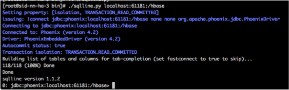

# Operations

## Metrics Collector

**Pid file locations**

Daemon | Default User                                 | Pid File Path
---------------|-------------------------------------------------|----------------------------------------
Metrics Collector API   |ams   |/var/run/ambari-metrics-collector/ambari-metrics-collector.pid
Metrics Collector Hbase |ams |/var/run/ambari-metrics-collector/hbase-ams-master.pid

**Log file locations**

Daemon | Log File Path
---------------|------------------------------------------------
Metrics Collector API    |/var/log/ambari-metrics-collector/ambari-metrics-collector.log<br></br>/var/log/ambari-metrics-collector/ambari-metrics-collector.out
Metrics Collector HBase  |/var/log/ambari-metrics-collector/hbase-ams-master-&lt;hostname&gt;.log<br></br>/var/log/ambari-metrics-collector/hbase-ams-master-&lt;hostname&gt;.out

**Manually restart Metrics Collector**

Stop command

```bash
su - ams -c '/usr/sbin/ambari-metrics-collector --config /etc/ambari-metrics-collector/conf/ stop'
```

Start command

```bash
su - ams -c '/usr/sbin/ambari-metrics-collector --config /etc/ambari-metrics-collector/conf/ start'
```

## Metrics Monitor

**Pid File location**

```
/var/run/ambari-metrics-monitor/ambari-metrics-monitor.pid
```

**Log File location**

```
/var/log/ambari-metrics-monitor/ambari-metrics-monitor.out
```

**Manually restart Metrics Monitor**
Stop command

```bash
su - ams -c '/usr/sbin/ambari-metrics-monitor --config /etc/ambari-metrics-monitor/conf stop'
```

Start command

```bash
su - ams -c '/usr/sbin/ambari-metrics-monitor --config /etc/ambari-metrics-monitor/conf start'
```

## Build Instructions

The ambari-metrics-assembly package builds the assemblies (rpm/deb/msi) for various platforms.

Following binaries can be found in the ambari-metrics-assembly/target folder after build is successful.

```
ambari-metrics-collecor-<ambari-version>.<arch>
ambari-metrics-monitor-<ambari-version>.<arch>
ambari-hadoop-sink-<ambari-version>.<arch>
```

**Note**: Ambari Metrics needs to be built before Ambari Server

### RPM packages

```bash
cd ambari-metrics
mvn clean package -Dbuild-rpm
```

### Debian packages
Same instruction as above, change the maven target to build-deb

### Windows msi
TBU

### Command line parameters

Parameter | Default Value | Comment
---------------|------------------|------------------------------
hbase.tar | http://public-repo-1.hortonworks.com/HDP/centos6/2.x/updates/2.3.0.0/tars/hbase-1.1.1.2.3.0.0-2557.tar.gz | HBase tarball. This is default version for Ambari 2.1.2
hbase.folder | hbase-1.1.1.2.3.0.0-2557 |-
hadoop.tar | http://public-repo-1.hortonworks.com/HDP/centos6/2.x/updates/2.3.0.0/tars/hadoop-2.7.1.2.3.0.0-2557.tar.gz | Hadoop tarball, used for native libs. This is default version for Ambari 2.1.2
hadoop.folder | hadoop-2.7.1.2.3.0.0-2557 |-

**Note**

After the change introducted by  [AMBARI-18915](https://issues.apache.org/jira/browse/AMBARI-18915) - Update AMS pom to use Apache hbase,hadoop,phoenix tarballs REOPENED AMS uses hadoop tars downloaded from Apache by default. Since that version of libhadoop is not built with libsnappy, the following config change in ams-site is needed to make AMS start up correctly.

**timeline.metrics.hbase.compression.scheme = None**

## Disk space utilization guidance

Num of Nodes | METRIC_RECORD (MB) | METRIC_RECORD_MINUTE (MB) | METRIC_RECORD_HOURLY (MB) | METRIC_RECORD_DAILY (MB) | METRIC_AGGREGATE (MB) | METRIC_AGGREGATE_MINUTE (MB) | METRIC_AGGREGATE_HOURLY (MB) | METRIC_AGGREGATE_DAILY (MB) | TOTAL (GB)
-------|----------|-----------|----------|----------|---------|--------|----------|-----------------|-------------
50  | 5120  | 2700  | 245   | 10  | 1500  |305 |28  |1 |10
100 | 10240 | 5400  | 490   | 20  | 1500  |305 |28  |1 |18
300 | 30720 | 16200 | 1470  | 60  | 1500  |305 |28  |1 |49
500 | 51200 | 27000 | 2450  | 100 | 1500  |305 |28  |1 |81
800 | 81920 | 43200 | 3920  | 160 | 1500  |305 |28  |1 |128

**NOTE**:

The above guidance has been derived from looking at AMS disk utilization in actual clusters.
The ACTUAL numbers have been obtained by observing an actual cluster with the basic services (HDFS, YARN, HBase) installed along with Storm, Kafka and Flume.
Kafka and Flume generate metrics only while a job is running. If those services are being used heavily, additional disk space is recommended. We ran sample jobs with STORM and KAFKA while deriving these numbers to make sure there is some contribution.

**Actual disk utilization data**

Num of Nodes | METRIC_RECORD (MB) | METRIC_RECORD_MINUTE (MB) | METRIC_RECORD_HOURLY (MB) | METRIC_RECORD_DAILY (MB) | METRIC_AGGREGATE (MB) | METRIC_AGGREGATE_MINUTE (MB) | METRIC_AGGREGATE_HOURLY (MB) | METRIC_AGGREGATE_DAILY (MB) | TOTAL (GB)
-------|----------|-----------|----------|----------|---------|--------|----------|-----------------|-------------
2   | 120   | 175 | 17  | 1 | 545     | 136 | 16  | 1 | 1
3   | 294   | 51  | 3.4 | 1 | 104     | 26  | 1.8 | 1 | 0.5
10  | 1024  | 540 | 49  | 2 | 1433.6  | 305 | 28  | 1 | 3.3

## Phoenix Schema

### Phoenix Tables

Table Name              | Description                                                               | Purge Interval(default)
------------------------|---------------------------------------------------------------------------|-------------------------
METRIC_RECORD           | Data per metric per host at 10 seconds precision with 1 minute aggregates.| 1 day
METRIC_RECORD_MINUTE    | Data per metric per host at 5 minute precision                            | 1 week
METRIC_RECORD_HOURLY    | Data per metric per host at 1 hour precision                              | 30 days
METRIC_RECORD_DAILY     | Data per metric per host at 1 day precision                               | 1 year
METRIC_AGGREGATE        | Cluster wide aggregates per metric at 30 seconds precision                | 1 week
METRIC_AGGREGATE_MINUTE | Cluster wide aggregates per metric at 5 minute precision                  | 30 days
METRIC_AGGREGATE_HOURLY | Cluster wide aggregates per metric at 1 hour precision                    | 1 year
METRIC_AGGREGATE_DAILY  | Cluster wide aggregates per metric at 1 day precision                     | 2 years

### Connecting to Phoenix
* Unpack Phoenix (4.2.0+) tarball onto the Metric Collector host
* Change director to phonenix-4.*/bin
* Edit sqlline.py and search for "java",  replace java with full path to the java executable, example: "/usr/jdk64/jdk1.8.0_40/bin/java" 
* Connect command: 
Ambari versions 2.2.0 and below : ./sqlline.py localhost:61181:/hbase
Ambari versions > 2.2.0  : 
```bash
./sqlline.py localhost:61181:/ams-hbase-unsecure (embedded mode) and <cluster-zookeeper-quorum-host>:<cluster_zookeeper_port>:/ams-hbase-unsecure (distributed mode)
```
