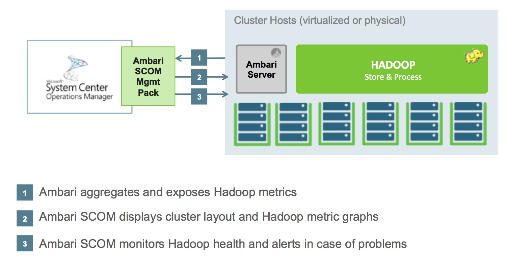
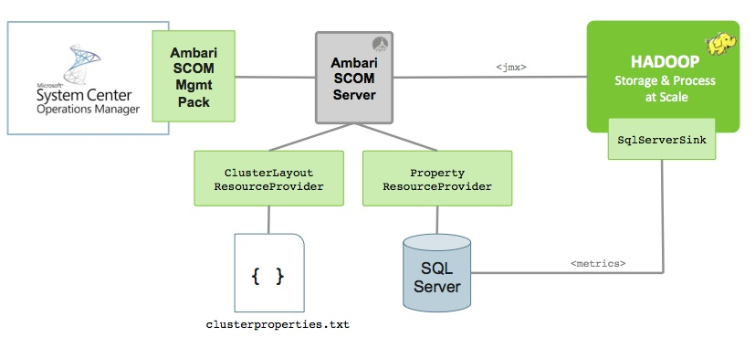

# Ambari SCOM Management Pack

This information is intended for **Apache Hadoop** and **Microsoft System Center Operations Manager** users who install the **Ambari SCOM Management Pack**.

## Introduction

### Versions

Ambari SCOM Version | Ambari Server Version | Version
--------------------|------------------------|---------
2.0.0 | 1.5.1 | 1.5.1.2.0.0.0-673
1.0.0 | 1.4.4 | 1.4.4.1.0.0.1-472
0.9.0 | 1.2.5 | 1.2.5.0.9.0.0-60

The Ambari SCOM contribution can be found in the Apache Ambari project:

- https://github.com/apache/ambari/tree/trunk/contrib/ambari-scom

### Useful Resources

The following links connect you to information about common tasks that are associated with System Center Management Packs:

- [Administering the Management Pack Life Cycle](http://go.microsoft.com/fwlink/?LinkId=211463)
- [How to Import a Management Pack in Operations Manager 2007](http://go.microsoft.com/fwlink/?LinkID=142351)
- [How to Monitor Using Overrides](http://go.microsoft.com/fwlink/?LinkID=117777)
- [How to Create a Run As Account in Operations Manager 2007](http://technet.microsoft.com/en-us/library/hh321655.aspx)
- [How to Modify an Existing Run As Profile](http://go.microsoft.com/fwlink/?LinkID=165412)
- [How to Export Management Pack Customizations](http://go.microsoft.com/fwlink/?LinkId=209940)
- [How to Remove a Management Pack](http://go.microsoft.com/fwlink/?LinkId=209941)

For questions about Operations Manager and monitoring packs, see the [System Center Operations Manager community forum](http://social.technet.microsoft.com/Forums/systemcenter/en-US/home?category=systemcenteroperationsmanager).

A useful resource is the [System Center Operations Manager Unleashed blog](http://opsmgrunleashed.wordpress.com/), which contains "By Example" posts for specific monitoring packs.

## Get Started

### Overview

**Ambari SCOM** extends the functionality of **Microsoft System Center Operations Manager** to monitor Apache Hadoop clusters, and leverages Ambari (and the Ambari REST API) to obtain Hadoop metrics. The Ambari SCOM Management Pack will:

- Automatically discover all nodes within a Hadoop cluster(s).
- Proactively monitor the availability and capacity.
- Proactively notify when the health is critical.
- Intuitively and efficiently visualize the health of Hadoop cluster via dashboards

### Architecture

Ambari SCOM is made up of the following components

Component | Description
----------|------------
Ambari SCOM Management Pack | The Ambari SCOM Management Pack extends the functional of Microsoft System Center Operations Manager to monitor Hadoop clusters.
Ambari SCOM Server | The Ambari SCOM Server component connects to the Hadoop cluster components and exposes a REST API for the Ambari SCOM Management Pack.
ResourceProvider | An Ambari ResourceProvider is a pluggable interface in Ambari enables the customization of the Ambari SCOM Server.
ClusterLayout ResourceProvider | An Ambari ResourceProvider implementation that supplies information on cluster layout (i.e. where Hadoop master and slave components are installed) to the Ambari SCOM Server. This allows Ambari to know how and where to access components of the Hadoop cluster.
Property ResourceProvider | An Ambari ResourceProvider implementation that integrates with the SQL Server database instance for retrieving stored Hadoop metrics.
SQL Server | A SQL Server instance that stores the metrics emitted from Hadoop via the SqlServerSink and the Hadoop Metrics2 interface.
SqlServerSink | This is a Hadoop Metrics2 sink designed to consume metrics emitted from the Hadoop cluster. Ambari SCOM provides a SQL Server implementation.

