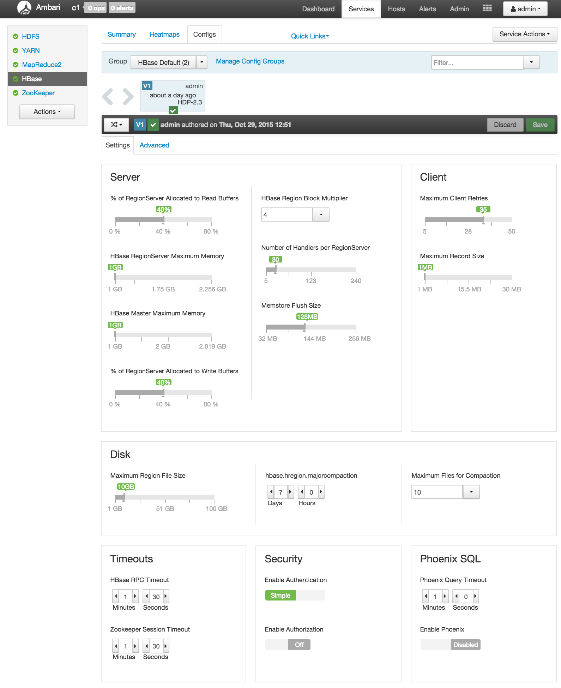
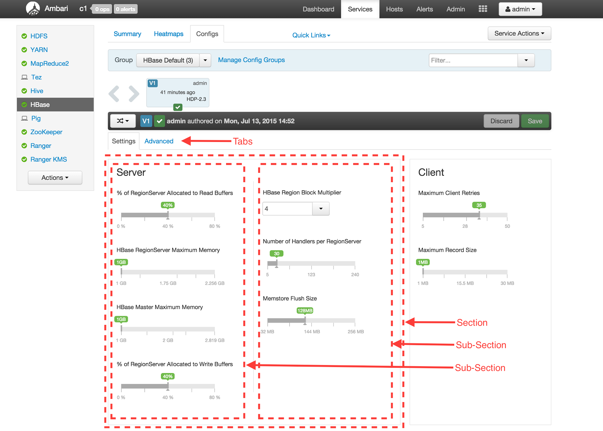

Introduced in Ambari-2.1.0, the Enhanced Configs feature makes it possible for service providers to customize their service's configs to a great deal and determine which configs are prominently shown to user without making any UI code changes. Customization includes providing a service friendly layout, better controls (sliders, combos, lists, toggles, spinners, etc.), better validation (minimum, maximum, enums), automatic unit conversion (MB, GB, seconds, milliseconds, etc.), configuration dependencies and improved dynamic recommendations of default values.

A service provider can accomplish all the above just by changing their service definition in the _stacks_/folder.

Example: HBase Enhanced Configs



## Features

* Define theme with custom layout of configs
  - Tabs
  - Sections
  - Sub-sections
* Place selected configs in the layout defined above
* Associate UI widget to use for a config
  - Radio Buttons
  - Slider
  - Combo
  - Time Interval Spinner
  - Toggle
  - Directory
  - Directories
  - List
  - Password
  - Text Field
  - Checkbox
  - Text Area
* Automatic unit conversion for configs which have to be shown in units different from the units being saved as.

  - Memory - B, KB, MB, GB, TB, PB
  - Time - milliseconds, seconds, minutes, hours, days, months, years
  - Percentage - float, percentage
* Ability to define dependencies between configurations across services (depends-on, depended-by).

* Ability to dynamically update values of other depended-by configs when a config is changed.

## Enable Enhanced Configs - Steps

### Step 1 - Create Theme (UI Metadata)

The first step is to create a theme for your service in the stack definition folder. A theme provides necessary information of the UI to construct the enhanced configs. UI information like layout (tabs, sections, sub-sections), placement of configs in the sub-sections, and which widgets and units to use for each config



1. Modify metainfo.xml to define a theme by including a themes block.

```
themes-dir      theme.json    true
```
2. The optional element can be used if the default theme folder of ' _themes_' is not desired, or taken by another service in the same _metainfo.xml_.

3. Multiple themes can be defined, however only the first _default_theme will be used for the service.

4. Each theme points to a theme JSON file (via _fileName_element) in the _themes-dir_folder.

5. The _theme.json_file contains one _configuration_block containing three main keys
  1. _layouts_- specify tabs, sections and sub-section layout
  2. _placement_- specify configurations to place in sub-sections
  3. _widgets_- specify which UI widgets to use for each config

```json
{  
  "configuration": {   
  "layouts": [      ...    ],  
  "placement": {      ...    },    
  "widgets": [      ...    ]  
  }
}
```
6. Layouts - Multiple layouts can be defined in a theme. Currently only the first layout will be used while rendering. A _layout_ has following content:
  1. Tabs: Multiple tabs can be defined in a layout. Each tab can have its contents laid out using a simple grid-layout using the _tab-columns_and _tab-rows_keys.

In below example the _Settings_tab has a grid of 3 rows and 2 columns in which sections can be placed.

```json
"layouts": [  
  {    
    "name": "default",   
     "tabs": [     
       {        
        "name": "settings",        
        "display-name": "Settings",       
         "layout": {         
           "tab-columns": "2",          
           "tab-rows": "3",          
           "sections": [ ... ]        
           }      
      }
     ] 
    }
]
```
  2. Sections: Each section is defined inside a tab and specifies its location and size inside the tab's grid-layout by using the _row-index_, _column-index_, _row-span_and _column-span_keys. Being a container itself, it can further define a grid-layout for the sub-sections it contains using the _section-rows_and _section-columns_keys.

In below example the _MapReduce_section occupies the first cell of the _Settings_tab grid, and itself has a grid-layout of 1 row and 3 columns.

```
"sections": [  {    "name": "section-mr-scheduler",    "display-name": "MapReduce",    "row-index": "0",    "column-index": "0",    "row-span": "1",    "column-span": "1",    "section-columns": "3",    "section-rows": "1",    "subsections": [ ... ]  },  ...]
```
  3. Sub-sections: Each sub-section is defined inside a section and specifies its location and size inside the section's grid-layout using the _row-index_, _column-index_, _row-span_and _column-span_keys. Each section also has an optional _border_boolean key which tells if a border should encapsulate its content.

```
"subsections": [  {    "name": "subsection-mr-scheduler-row1-col1",    "display-name": "MapReduce Framework",    "row-index": "0",    "column-index": "0",    "row-span": "1",    "column-span": "1"  },  ...]
```
7. Placement: Specifies the order of configurations that are to be placed into each sub-section. Each placement identifies a config, and which sub-section it should appear in. The placement specifies which layout it applies to using the _configuration-layout_key.

```
"placement": {  "configuration-layout": "default",  "configs": [    {      "config": "mapred-site/mapreduce.map.memory.mb",      "subsection-name": "subsection-mr-scheduler-row1-col1"    },    {      "config": "mapred-site/mapreduce.reduce.memory.mb",      "subsection-name": "subsection-mr-scheduler-row1-col2"    },    ...  ]}
```
8. Wigets: The widgets array specifies which UI widget should be used to show a specific config. It also contains extra UI specific metadata required to show the widget.

In the example below, both configs are using the slider widget. However the unit varies, resulting in one config being shown in bytes and another being shown as percentage. This unit is purely for showing a config - which is different from the units in which it is actually persisted in Ambari. For example, the percent unit below maybe persisted as a _float_, while the MB config below can be persisted in B (bytes).

```
"widgets": [  {    "config": "yarn-site/yarn.nodemanager.resource.memory-mb",    "widget": {      "type": "slider",      "units": [        {          "unit-name": "MB"        }      ]    }  },  {    "config": "yarn-site/yarn.nodemanager.resource.percentage-physical-cpu-limit",    "widget": {      "type": "slider",      "units": [        {          "unit-name": "percent"        }      ]   } }, {   "config": "yarn-site/yarn.node-labels.enabled",   "widget": {     "type": "toggle"   } }, ...]
```

For a complete reference to what UI widgets are available and what metadata can be specified per widget, please refer to _Appendix A_.

### Step 2 - Annotate stack configs (Non-UI Metadata)

Each configuration that is used by the service's theme has to provide extra metadata about the configuration. The list of available metadata are:

* display-name
* value-attributes
  - type
    + string
    + value-list
    + float
    + int
    + boolean
  - minimum
  - maximum
  - unit
  - increment-step
  - entries
    + entry
      * value
      * description
* depends-on
  - property
    + type
    + name

The value-attributes provide meta information about the value that can used as hints by the appropriate widget. For example the slider widget can make use of the minimum and maximum values in its working.

Examples:

```xml
<property>
  <name>namenode_heapsize</name>
  <value>1024</value>
  <description>NameNode Java heap size</description>
  <display-name>NameNode Java heap size</display-name>
  <value-attributes>
    <type>int</type>
    <minimum>0</minimum>
    <maximum>268435456</maximum>
    <unit>MB</unit>
    <increment-step>256</increment-step>
  </value-attributes>
  <depends-on>
    <property>
      <type>hdfs-site</type>
      <name>dfs.datanode.data.dir</name>
    </property>
  </depends-on>
</property>

```

```xml
<property>
  <name>hive.default.fileformat</name>
  <value>TextFile</value>
  <description>Default file format for CREATE TABLE statement.</description>
  <display-name>Default File Format</display-name>
  <value-attributes>
    <type>value-list</type>
    <entries>
      <entry>
        <value>ORC</value>
        <description>The Optimized Row Columnar (ORC) file format provides a highly efficient way to store Hive data. It was designed to overcome limitations of the other Hive file formats. Using ORC files improves performance when Hive is reading, writing, and processi
      </entry>
      <entry>
        <value>TextFile</value>
        <description>Text file format saves Hive data as normal text.</description>
      </entry>
    </entries>
  </value-attributes>
</property>
```

The depends-on is useful in building a dependency graph between different configs in Ambari. Ambari uses these bi-directional relationships (depends-on and depended-by) to automatically update dependent configs using the stack-advisor functionality in Ambari.

Dependencies between configurations is a directed-acyclic-graph (DAG). When a configuration is updated, the UI has to determine its effect on other configs in the graph. To determine this, the /recommendations_endpoint should be provided an array of what configurations have been just changed in the changed_configurations field. Based on the provided changed-configs, only its dependencies are updated in the response.

Example:

Figure below shows some config dependencies - A effects B and C, each of which effects DE and FG respectively.


Now assume user changes B to B' - a call to _/_ _recommendations_will only change D and E to D' and E' respectively (AB'CD'E'FG). No other config will be changed. Now assume that C is changed to C' -/recommendations will only change F and G to F' and G' while still keeping the values of B' D' E' intact (AB'C'D'E'F'G'). Now if you change A to A', it will affect all its children (A'B''C''D''E''F''G''). The user will have chance to pick and choose which he wants to apply.

The call to _/recommendations_ happens whenever a configuration with dependencies is changed. The POST call has the action configuration-dependencies - which will only change the configurations and its dependencies identified by the changed_configurations field.

### Step 3 - Restart Ambari server

Restarting ambari-server is required for any changes in the themes or the stack-definition to be loaded.

## Reference

* HDFS HDP-2.2 [theme.json](https://github.com/apache/ambari/blob/branch-2.1.2/ambari-server/src/main/resources/stacks/HDP/2.2/services/HDFS/themes/theme.json)
* YARN HDP-2.2 [theme.json](https://github.com/apache/ambari/blob/branch-2.1.2/ambari-server/src/main/resources/stacks/HDP/2.2/services/YARN/themes/theme.json)
* HIVE HDP-2.2 [theme.json](https://github.com/apache/ambari/blob/branch-2.1.2/ambari-server/src/main/resources/stacks/HDP/2.2/services/HIVE/themes/theme.json)
* RANGER HDP-2.3 [theme_version_2.json](https://github.com/apache/ambari/blob/trunk/ambari-server/src/main/resources/stacks/HDP/2.3/services/RANGER/themes/theme_version_2.json)

## Appendix

### Appendix A - Widget Non-UI Metadata

<table>
  <tr>
    <th>Widget</th>
    <th>Metadata Used</th>
  </tr>
  <tr>
    <td>Slider</td>
    <td>
    &lt;value-attributes&gt;<br></br>
      &lt;type&gt;int&lt;/type&gt;<br></br>
      &lt;minimum&gt;1073741824&lt;/minimum&gt;<br></br>
      &lt;maximum&gt;17179869184&lt;/maximum&gt;<br></br>
      &lt;unit&gt;B&lt;/unit&gt;<br></br>
      &lt;increment-step&gt;1073741824&lt;/increment-step&gt;<br></br>
    &lt;/value-attributes&gt;
    </td>
  </tr>
  <tr>
    <td>Combo</td>
    <td>
    &lt;value-attributes&gt; <br></br>
      &lt;type&gt;value-list&lt;/type&gt;<br></br>
      &lt;entries&gt;<br></br>
        &lt;entry&gt;<br></br>
          &lt;value&gt;2&lt;/value&gt;<br></br>
        &lt;/entry&gt;<br></br>
        &lt;entry&gt;<br></br>
          &lt;value&gt;4&lt;/value&gt;<br></br>
        &lt;/entry&gt;<br></br>
        &lt;entry&gt;<br></br>
          &lt;value&gt;8&lt;/value&gt;<br></br>
        &lt;/entry&gt;<br></br>
      &lt;/entries&gt;<br></br>
      &lt;selection-cardinality&gt;1&lt;/selection-cardinality&gt;<br></br>
    &lt;/value-attributes&gt;
    </td>
  </tr>
  <tr>
    <td>Directory, Directories, Password, Text Field, Text Area</td>
    <td>No value-attributes required</td>
  </tr>
  <tr>
    <td>List</td>
    <td>
    &lt;value-attributes&gt;                                          <br></br>
  &lt;type&gt;value-list&lt;/type&gt;<br></br>
  &lt;entries&gt;<br></br>
    &lt;entry&gt;<br></br>
      &lt;value&gt;2&lt;/value&gt;<br></br>
    &lt;/entry&gt;<br></br>
    &lt;entry&gt;<br></br>
      &lt;value&gt;4&lt;/value&gt;<br></br>
    &lt;/entry&gt;<br></br>
    &lt;entry&gt;<br></br>
      &lt;value&gt;8&lt;/value&gt;<br></br>
    &lt;/entry&gt;<br></br>
  &lt;/entries&gt;<br></br>
  &lt;selection-cardinality&gt;2+&lt;/selection-cardinality&gt;<br></br>
&lt;/value-attributes&gt;<br></br>
    </td>
  </tr>
  <tr>
    <td>Radio-Buttons</td>
    <td>
   &lt;value-attributes&gt;                                    <br></br>
  &lt;type&gt;value-list&lt;/type&gt;<br></br>
  &lt;entries&gt;<br></br>
    &lt;entry&gt;<br></br>
      &lt;value&gt;1&lt;/value&gt;<br></br>
      &lt;label&gt;Radio Option 1&lt;/label&gt;<br></br>
    &lt;/entry&gt;<br></br>
    &lt;entry&gt;<br></br>
      &lt;value&gt;2&lt;/value&gt;<br></br>
      &lt;label&gt;Radio Option 2&lt;/label&gt;<br></br>
    &lt;/entry&gt;<br></br>
    &lt;entry&gt;<br></br>
      &lt;value&gt;3&lt;/value&gt;<br></br>
      &lt;label&gt;Radio Option 3&lt;/label&gt;<br></br>
    &lt;/entry&gt;<br></br>
  &lt;/entries&gt;<br></br>
  &lt;selection-cardinality&gt;1&lt;/selection-cardinality&gt;<br></br>
&lt;/value-attributes&gt;   
    </td>
  </tr>
  <tr>
    <td>Time Interval Spinner</td>
    <td>
&lt;value-attributes&gt;                   <br></br>
  &lt;type&gt;int&lt;/type&gt;<br></br>
  &lt;minimum&gt;0&lt;/minimum&gt;<br></br>
  &lt;maximum&gt;2592000000&lt;/maximum&gt;<br></br>
  &lt;unit&gt;milliseconds&lt;/unit&gt;<br></br>
&lt;/value-attributes&gt;
    </td>
  </tr>
  <tr>
    <td>Toggle, Checkbox</td>
    <td>
 &lt;value-attributes&gt;                                       
  &lt;type&gt;value-list&lt;/type&gt;<br></br>
  &lt;entries&gt;<br></br>
    &lt;entry&gt;<br></br>
      &lt;value&gt;true&lt;/value&gt;<br></br>
      &lt;label&gt;Native&lt;/label&gt;<br></br>
    &lt;/entry&gt;<br></br>
    &lt;entry&gt;<br></br>
      &lt;value&gt;false&lt;/value&gt;<br></br>
      &lt;label&gt;Off&lt;/label&gt;<br></br>
    &lt;/entry&gt;<br></br>
  &lt;/entries&gt;<br></br>
  &lt;selection-cardinality&gt;1&lt;/selection-cardinality&gt;<br></br>
&lt;/value-attributes&gt;   
    </td>
  </tr>
</table>
