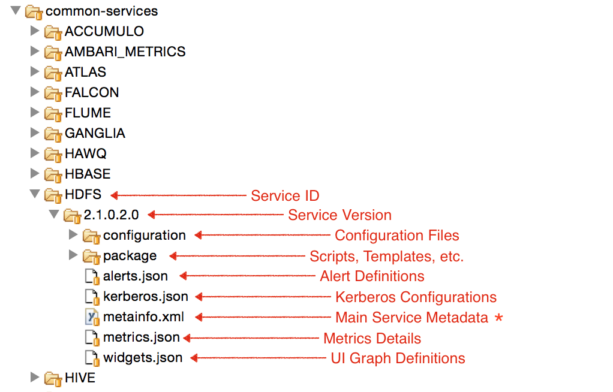
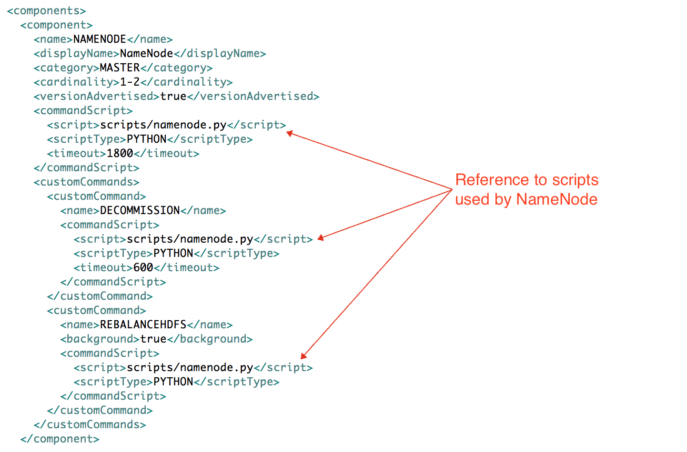
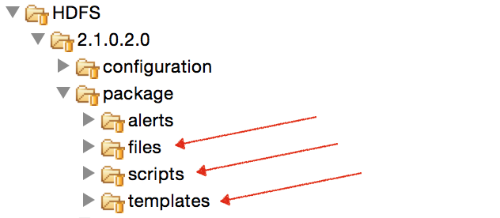
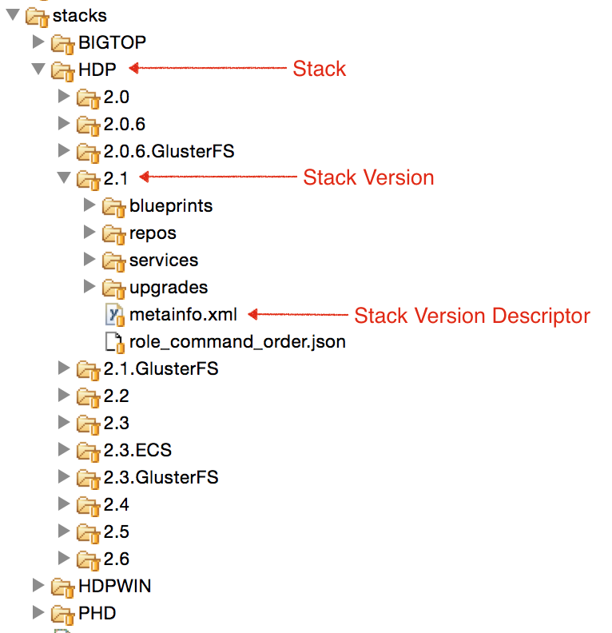

# How-To Define Stacks and Services

Services managed by Ambari are defined in its _stacks_ folder .

To define your own services and stacks to be managed by Ambari, follow the steps below.

There is also an example you can follow on how to [create your custom stack and service](./defining-a-custom-stack-and-services.md).

A stack is a collection of services. Multiple versions of a stack can be defined, each with its own set of services. Stacks in Ambari are defined in [ambari-server/src/main/resources/stacks ;](https://github.com/apache/ambari/tree/trunk/ambari-server/src/main/resources/stacks)folder, which can be found at **/var/lib/ambari-server/resources/stacks** folder after install.

Services managed by a stack can be defined either in [ambari-server/src/main/resources/common-services](https://github.com/apache/ambari/tree/trunk/ambari-server/src/main/resources/common-services)or [ambari-server/src/main/resources/stacks](https://github.com/apache/ambari/tree/trunk/ambari-server/src/main/resources/stacks)folders. These folders after install can be found at _/var/lib/ambari-server/resources/common-services_ or _/var/lib/ambari-server/resources/stacks_ folders respectively.

> **Question: When do I define service in _common-services_ vs. _stacks_ folders?**
One would define services in the [common-services](https://github.com/apache/ambari/tree/trunk/ambari-server/src/main/resources/common-services)folder if there is possibility of the service being used in multiple stacks. For example, almost all stacks would need the HDFS service - so instead of redefining HDFS in each stack, the one defined in common-services is referenced .Likewise, if a service is never going to be shared, it can be defined in the [stacks](https://github.com/apache/ambari/tree/trunk/ambari-server/src/main/resources/stacks)folder.Basically services defined in stacks folder are used by containment, whereas the ones defined in common-services are used by reference.

## Define Service

Shown below is how to define a service in _common-services_ folder. The same approach can be taken when defining services in the _stacks_ folder, which will be discussed in the _Define Stack_ section.



Services **MUST** provide the main _metainfo.xml_ file which provides important metadata about the service.

Apart from that, other files can be provided to give more information about the service. More details about these files are provided below.

A service may also inherit from either a previous stack version or common services. For more information see the [Service Inheritance](./stack-inheritance.md) page.

### _metainfo.xml_

In the _metainfo.xml_ service descriptor, one can first define the service and its components.

Complete reference can be found in the [Writing metainfo.xml](./writing-metainfo.md) page.

A good reference implementation is the [HDFS metainfo.xml](https://github.com/apache/ambari/blob/trunk/ambari-server/src/main/resources/common-services/HDFS/2.1.0.2.0/metainfo.xml#L27).

> **Question: Is it possible to define multiple services in the same metainfo.xml?**
Yes. Though it is possible, it is discouraged to define multiple services in the same service folder.

YARN and MapReduce2 are services that are defined together in the [YARN folder](https://github.com/apache/ambari/tree/trunk/ambari-server/src/main/resources/common-services/YARN/2.1.0.2.0). Its [metainfo.xml](https://github.com/apache/ambari/blob/trunk/ambari-server/src/main/resources/common-services/YARN/2.1.0.2.0/metainfo.xml) defines both services.

#### Scripts

With the components defined, we need to provide scripts which can handle the various stages of the service and component's lifecycle.

The scripts necessary to manage service and components are specified in the _metainfo.xml_ ([HDFS](https://github.com/apache/ambari/blob/trunk/ambari-server/src/main/resources/common-services/HDFS/2.1.0.2.0/metainfo.xml#L35))
Each of these scripts should extend the [Script](https://github.com/apache/ambari/blob/branch-2.2.1/ambari-common/src/main/python/resource_management/libraries/script/script.py) class which provides useful methods. Example: [NameNode script](https://github.com/apache/ambari/blob/branch-2.2.1/ambari-server/src/main/resources/common-services/HDFS/2.1.0.2.0/package/scripts/namenode.py#L68)



These scripts should be provided in the __ folder.



**package/scripts**
Folder | Purpose
-------|--------
**package/scripts** | Contains scripts invoked by Ambari. These scripts are loaded into the execution path with the correct environment.<br></br>Example: [HDFS](https://github.com/apache/ambari/tree/trunk/ambari-server/src/main/resources/common-services/HDFS/2.1.0.2.0/package/scripts) 
**package/files** | Contains files used by above scripts. Generally these are other scripts (bash, python, etc.) invoked as a separate process.<br></br>Example: [checkWebUI.py](https://github.com/apache/ambari/blob/trunk/ambari-server/src/main/resources/common-services/HDFS/2.1.0.2.0/package/files/checkWebUI.py) is run in HDFS service-check to determine if Journal Nodes are available
**package/templates** | Template files used by above scripts to generate files on managed hosts. These are generally configuration files required by the service to operate.<br></br>Example: [exclude_hosts_list.j2](https://github.com/apache/ambari/blob/trunk/ambari-server/src/main/resources/common-services/HDFS/2.1.0.2.0/package/templates/exclude_hosts_list.j2) which is used by scripts to generate _/etc/hadoop/conf/dfs.exclude_

#### Python

Ambari by default supports Python scripts for management of service and components.

Component scripts should extend `resource_management.Script` class and provide methods required for that component's lifecycle.

Taken from the page on [how to create custom stack](./defining-a-custom-stack-and-services.md), the following methods are needed for MASTER, SLAVE and CLIENT components to go through their lifecycle.

```python
import sys
from resource_management import Script
class Master(Script):
  def install(self, env):
    print 'Install the Sample Srv Master';
  def stop(self, env):
    print 'Stop the Sample Srv Master';
  def start(self, env):
    print 'Start the Sample Srv Master';
  def status(self, env):
    print 'Status of the Sample Srv Master';
  def configure(self, env):
    print 'Configure the Sample Srv Master';
if __name__ == "__main__":
  Master().execute()
```

```python
import sys
from resource_management import Script
class Slave(Script):
  def install(self, env):
    print 'Install the Sample Srv Slave';
  def stop(self, env):
    print 'Stop the Sample Srv Slave';
  def start(self, env):
    print 'Start the Sample Srv Slave';
  def status(self, env):
    print 'Status of the Sample Srv Slave';
  def configure(self, env):
    print 'Configure the Sample Srv Slave';
if __name__ == "__main__":
  Slave().execute()
```

```python
import sys
from resource_management import Script
class SampleClient(Script):
  def install(self, env):
    print 'Install the Sample Srv Client';
  def configure(self, env):
    print 'Configure the Sample Srv Client';
if __name__ == "__main__":
  SampleClient().execute()
```

Ambari provides helpful Python libraries below which are useful in writing service scripts. For complete reference on these libraries visit the [Ambari Python Libraries](https://cwiki.apache.org/confluence/display/AMBARI/Ambari+Python+Libraries) page.

* resource_management
* ambari_commons
* ambari_simplejson

##### OS Variant Scripts

If the service is supported on multiple OSes which requires separate scripts, the base _resource_management.Script_ class can be extended with different _@OsFamilyImpl()_ annotations.

This allows for the separation of only OS specific methods of the component.

Example: [NameNode default script](https://github.com/apache/ambari/blob/trunk/ambari-server/src/main/resources/common-services/HDFS/2.1.0.2.0/package/scripts/namenode.py#L126), [NameNode Windows script](https://github.com/apache/ambari/blob/trunk/ambari-server/src/main/resources/common-services/HDFS/2.1.0.2.0/package/scripts/namenode.py#L346).

> **Examples**
NameNode [Start](https://github.com/apache/ambari/blob/trunk/ambari-server/src/main/resources/common-services/HDFS/2.1.0.2.0/package/scripts/hdfs_namenode.py#L93), [Stop](https://github.com/apache/ambari/blob/trunk/ambari-server/src/main/resources/common-services/HDFS/2.1.0.2.0/package/scripts/hdfs_namenode.py#L208).

DataNode [Start and Stop](https://github.com/apache/ambari/blob/trunk/ambari-server/src/main/resources/common-services/HDFS/2.1.0.2.0/package/scripts/hdfs_datanode.py#L68).

HDFS [configurations persistence](https://github.com/apache/ambari/blob/trunk/ambari-server/src/main/resources/common-services/HDFS/2.1.0.2.0/package/scripts/hdfs.py#L31)

#### Custom Actions

Sometimes services need to perform actions unique to that service which go beyond the default actions provided by Ambari (like _install_ , _start, stop, configure,_ etc.).

Services can define such actions and expose them to the user in UI so that they can be easily invoked.

As an example, we show the _Rebalance HDFS_ custom action implemented by HDFS.

##### Stack Changes

1. [Define custom command inside the _customCommands_ section](https://github.com/apache/ambari/blob/branch-2.2.1/ambari-server/src/main/resources/common-services/HDFS/2.1.0.2.0/metainfo.xml#L49) of the component in _metainfo.xml_.

2. [Implement method with same name as custom command](https://github.com/apache/ambari/blob/branch-2.2.1/ambari-server/src/main/resources/common-services/HDFS/2.1.0.2.0/package/scripts/namenode.py#L273) in script referenced from _metainfo.xml_.

  1. If custom command does not have OS variants, it can be implemented in the same class that extends _resource_management.Script_
  2. If there are OS variants, different methods can be implemented in each class annotated by _@OsFamilyImpl(os_family=...)_. [Default rebalancehdfs](https://github.com/apache/ambari/blob/branch-2.2.1/ambari-server/src/main/resources/common-services/HDFS/2.1.0.2.0/package/scripts/namenode.py#L273),[Windows rebalancehdfs](https://github.com/apache/ambari/blob/branch-2.2.1/ambari-server/src/main/resources/common-services/HDFS/2.1.0.2.0/package/scripts/namenode.py#L354).

This will provide ability by the backend to run the script on all managed hosts where the service is installed.

##### UI Changes

No UI changes are necessary to see the custom action on the host page.

The action should show up in the host-component's list of actions. Any master-component actions will automatically show up on the service's action menu.

When the action is clicked in UI, the POST call is made automatically to trigger the script defined above.

> **Question: How do I provide my own label and icon for the custom action in UI?**
In Ambari UI, add your component action to the _App.HostComponentActionMap_ object with custom icon and name. Ex: [REBALANCEHDFS](https://github.com/apache/ambari/blob/branch-2.2.1/ambari-web/app/models/host_component.js#L351).

### Configuration

Configuration files for a service should be placed by default in the _ [configuration](https://github.com/apache/ambari/tree/branch-2.2.1/ambari-server/src/main/resources/common-services/HDFS/2.1.0.2.0/configuration)_ folder.

If a different named folder has to be used, the [< _configuration-dir>_](https://github.com/apache/ambari/blob/branch-2.2.1/ambari-server/src/main/resources/common-services/YARN/2.1.0.2.0/metainfo.xml#L249) element can be used in _metainfo.xml_ to point to that folder.

The important sections of the metainfo.xml with regards to configurations are:

```xml
<?xml version="1.0"?>
<metainfo>
  <schemaVersion>2.0</schemaVersion>
  <services>
    <service>
      <name>HDFS</name>
      <displayName>HDFS</displayName>
      <comment>Apache Hadoop Distributed File System</comment>
      <version>2.1.0.2.0</version>
      <components>
        ...
        <component>
          <name>HDFS_CLIENT</name>
          ...
          <configFiles>
            <configFile>
              <type>xml</type>
              <fileName>hdfs-site.xml</fileName>
              <dictionaryName>hdfs-site</dictionaryName>
            </configFile>
            <configFile>
              <type>xml</type>
              <fileName>core-site.xml</fileName>
              <dictionaryName>core-site</dictionaryName>
            </configFile>
            <configFile>
              <type>env</type>
              <fileName>log4j.properties</fileName>
              <dictionaryName>hdfs-log4j,yarn-log4j</dictionaryName>
            </configFile>                         
            <configFile>
              <type>env</type>
              <fileName>hadoop-env.sh</fileName>
              <dictionaryName>hadoop-env</dictionaryName>
            </configFile>
          </configFiles>
          ...
          <configuration-dependencies>
             <config-type>core-site</config-type>
             <config-type>hdfs-site</config-type>
          </configuration-dependencies>
        </component>
          ...
      </components>
  
      <configuration-dir>configuration</configuration-dir>
      <configuration-dependencies>
        <config-type>core-site</config-type>
        <config-type>hdfs-site</config-type>
        <config-type>hadoop-env</config-type>
        <config-type>hadoop-policy</config-type>
        <config-type>hdfs-log4j</config-type>
        <config-type>ranger-hdfs-plugin-properties</config-type>
        <config-type>ssl-client</config-type>
        <config-type>ssl-server</config-type>
        <config-type>ranger-hdfs-audit</config-type>
        <config-type>ranger-hdfs-policymgr-ssl</config-type>
        <config-type>ranger-hdfs-security</config-type>
        <config-type>ams-ssl-client</config-type>
      </configuration-dependencies>
    </service>
  </services>
</metainfo>
```

* **config-type** - String representing a group of configurations. Example: _core-site, hdfs-site, yarn-site_, etc. When configurations are saved in Ambari, they are persisted within a version of config-type which is immutable. If you change and save HDFS core-site configs 4 times, you will have 4 versions of config-type core-site. Also, when a service's configs are saved, only the changed config-types are updated.

* **configFiles** - lists the config-files handled by the enclosing component
* **configFile** - represents one config-file of a certain type

  - **type** - type of file based on which contents are generated differently

    + **xml** - XML file generated in Hadoop friendly format. Ex:[hdfs-site.xml](https://github.com/apache/ambari/blob/trunk/ambari-server/src/main/resources/common-services/HDFS/2.1.0.2.0/configuration/hdfs-site.xml)
    + **env** - Generally used for scripts where the content value is used as a template. The template has config-tags whose values are populated at runtime during file generation. Ex:[hadoop-env.sh](https://github.com/apache/ambari/blob/trunk/ambari-server/src/main/resources/common-services/HDFS/2.1.0.2.0/configuration/hadoop-env.xml)
    + **properties** - Generates property files where entries are in key=value format. Ex:[falcon-runtime.properties](https://github.com/apache/ambari/blob/trunk/ambari-server/src/main/resources/common-services/FALCON/0.5.0.2.1/configuration/falcon-runtime.properties.xml)
  - **dictionaryName** - Name of the config-type as which key/values of this config file will be stored
* **configuration-dependencies** - Lists the config-types on which this component or service depends on. One of the implications of this dependency is that whenever the config-type is updated, Ambari automatically marks the component or service as requiring restart. From the code section above, whenever _core-site_ is updated, both HDFS service as well as HDFS_CLIENT component will be marked as requiring restart.

* **configuration-dir** - Directory where files listed in _configFiles_ will be. Optional. Default value is _configuration_.

#### Adding new configs in a config-type

There are a number of different parameters that can be specified to a config item when it is added to a config-type. These have been covered [here](https://cwiki.apache.org/confluence/display/AMBARI/Configuration+support+in+Ambari).

#### UI - Categories

Configurations defined above show up in the service's _Configs_ page.

To customize categories and ordering of configurations in UI, the following files have to be updated.

**Create Category** - Update the _ [ambari-web/app/models/stack_service.js](https://github.com/apache/ambari/blob/trunk/ambari-web/app/models/stack_service.js#L226)_ file to add your own service, along with your new categories.

**Use Category** - To place configs inside a defined category, and specify an order in which configs are placed, add configs to [ambari-web/app/data/HDP2/site_properties.js](https://github.com/apache/ambari/blob/trunk/ambari-web/app/data/HDP2/site_properties.js) file. In this file one can specify the category to use, and the index where a config should be placed. The stack folders in [ambari-web/app/data](https://github.com/apache/ambari/tree/trunk/ambari-web/app/data) are hierarchical and inherit from previous versions. The mapping of configurations into sections is defined here. Example [Hive Categories](https://github.com/apache/ambari/blob/trunk/ambari-web/app/data/HDP2.2/hive_properties.js), [Tez Categories](https://github.com/apache/ambari/blob/trunk/ambari-web/app/data/HDP2.2/tez_properties.js).

#### UI - Enhanced Configs

The _Enhanced Configs_feature makes it possible for service providers to customize their service's configs to a great deal and determine which configs are prominently shown to user without making any UI code changes. Customization includes providing a service friendly layout, better controls (sliders, combos, lists, toggles, spinners, etc.), better validation (minimum, maximum, enums), automatic unit conversion (MB, GB, seconds, milliseconds, etc.), configuration dependencies and improved dynamic recommendations of default values.

A service provider can accomplish all the above just by changing their service definition in the _stacks_/folder.

Read more in the _ [Enhanced Configs](https://cwiki.apache.org/confluence/display/AMBARI/Enhanced+Configs)_ page

### Alerts

Each service is capable of defining which alerts Ambari should track by providing an [alerts.json](https://github.com/apache/ambari/blob/trunk/ambari-server/src/main/resources/common-services/HDFS/2.1.0.2.0/alerts.json) file.

Read more about Ambari Alerts framework [in the Alerts wiki page](https://cwiki.apache.org/confluence/display/AMBARI/Alerts) and the alerts.json format in the [Alerts definition documentation](https://github.com/apache/ambari/blob/branch-2.1/ambari-server/docs/api/v1/alert-definitions.md).

### Kerberos

Ambari is capable of enabling and disabling Kerberos for a cluster. To inform Ambari of the identities and configurations to be used for the service and its components, each service can provide a _kerberos.json_ file.

Read more about Kerberos support in the _ [Automated Kerberization](https://cwiki.apache.org/confluence/display/AMBARI/Automated+Kerberizaton)_ wiki page and the Kerberos descriptor in the [Kerberos Descriptor documentation](https://github.com/apache/ambari/blob/trunk/ambari-server/docs/security/kerberos/kerberos_descriptor.md).

### Metrics

Ambari provides the [Ambari Metrics System ("AMS")](https://cwiki.apache.org/confluence/display/AMBARI/Metrics)service for collecting, aggregating and serving Hadoop and system metrics in Ambari-managed clusters.

Each service can define which metrics AMS should collect and provide by defining a [metrics.json](https://github.com/apache/ambari/blob/trunk/ambari-server/src/main/resources/common-services/HDFS/2.1.0.2.0/metrics.json) file.

You can read about the metrics.json file format in the [Stack Defined Metrics](https://cwiki.apache.org/confluence/display/AMBARI/Stack+Defined+Metrics) page.

### Quick Links

A service can add a list of quick links to the Ambari web UI by adding metainfo to a text file following a predefined JSON format. Ambari server parses the quicklink JSON file and provides its content to the UI. So that Ambari web UI can calculate quick link URLs based on the information and populate the quicklinks drop-down list accordingly.

Read more about quick links JSON file design in the [Quick Links](../quick-links.md) page.

### Widgets

Each service can define which widgets and heatmaps show up by default on the service summary page by defining a [widgets.json](https://github.com/apache/ambari/blob/trunk/ambari-server/src/main/resources/common-services/HDFS/2.1.0.2.0/widgets.json) file.

You can read more about the widgets descriptor in the [Enhanced Service Dashboard](https://cwiki.apache.org/confluence/display/AMBARI/Enhanced+Service+Dashboard) page.

### Role Command Order

From Ambari 2.2, each service can define its own role command order by including the [role_command_order.json](https://github.com/apache/ambari/blob/trunk/ambari-server/src/main/resources/stacks/HDP/2.0.6/role_command_order.json) file in its service folder. The service should only specify the relationship of its components to other components. In other words, if a service only includes COMP_X, it should only list dependencies related to COMP_X. If when COMP_X starts it is dependent on the NameNode start and when the NameNode stops it should wait for COMP_X to stop, the following would be included in the role command order:

**Example service role_command_order.json**
```json
"COMP_X-START": ["NAMENODE-START"],
    "NAMENODE-STOP": ["COMP_X-STOP"]
```

The entries in the service's role command order will be merged with the role command order defined in the stack. For example, since the stack already has a dependency for NAMENODE-STOP, in the example above COMP_X-STOP would be added to the rest of the NAMENODE-STOP dependencies and in addition the COMP_X-START dependency on NAMENODE-START would just be added as a new dependency.

For more details on role command order, see the [Role Command Order](https://cwiki.apache.org/confluence/display/AMBARI/How-To+Define+Stacks+and+Services#How-ToDefineStacksandServices-RoleCommandOrder) section below.

### Service Advisor

From Ambari 2.4, each service can choose to define its own service advisor rather than define the details of its configuration and layout in the stack advisor. This is particularly useful for custom services which are not defined in the stack. Ambari provides the _Service Advisor_ capability where a service can write a Python script named _service-advisor.py_ in their service folder. This folder can be in the stack's services directory where the service is defined or can be inherited from the service definition in common-services or elsewhere. Example: [common-services/HAWQ/2.0.0](https://github.com/apache/ambari/tree/trunk/ambari-server/src/main/resources/common-services/HAWQ/2.0.0).

Unlike the Stack-advisor scripts, the service-advisor scripts do not automatically extend the parent service's service-advisor scripts. The service-advisor script needs to explicitly extend their parent's service service-advisor script. The following code sample shows how you would refer to a parent's service_advisor.py. In this case it is extending the root service-advisor.py file in the resources/stacks directory.

**Sample service-advisor.py file inheritance**
```python
SCRIPT_DIR = os.path.dirname(os.path.abspath(__file__))
STACKS_DIR = os.path.join(SCRIPT_DIR, '../../../stacks/')
PARENT_FILE = os.path.join(STACKS_DIR, 'service_advisor.py')

try:
  with open(PARENT_FILE, 'rb') as fp:
    service_advisor = imp.load_module('service_advisor', fp, PARENT_FILE, ('.py', 'rb', imp.PY_SOURCE))
except Exception as e:
  traceback.print_exc()
  print "Failed to load parent"

class HAWQ200ServiceAdvisor(service_advisor.ServiceAdvisor):
```

Like the stack advisors, service advisors provide information on 4 important aspects:

1. Recommend layout of the service on cluster
2. Recommend service configurations
3. Validate layout of the service on cluster
4. Validate service configurations

By providing the service-advisor.py file, one can control dynamically each of the above for the service.

The main interface for the service-advisor scripts contains documentation on how each of the above are called, and what data is provided.

```python
class ServiceAdvisor(DefaultStackAdvisor):
"""
  Abstract class implemented by all service advisors.

"""

"""
  If any components of the service should be colocated with other services,
  this is where you should set up that layout.  Example:

    # colocate HAWQSEGMENT with DATANODE, if no hosts have been allocated for HAWQSEGMENT
    hawqSegment = [component for component in serviceComponents if component["StackServiceComponents"]["component_name"] == "HAWQSEGMENT"][0]
    if not self.isComponentHostsPopulated(hawqSegment):
      for hostName in hostsComponentsMap.keys():
        hostComponents = hostsComponentsMap[hostName]
        if {"name": "DATANODE"} in hostComponents and {"name": "HAWQSEGMENT"} not in hostComponents:
          hostsComponentsMap[hostName].append( { "name": "HAWQSEGMENT" } )
        if {"name": "DATANODE"} not in hostComponents and {"name": "HAWQSEGMENT"} in hostComponents:
          hostComponents.remove({"name": "HAWQSEGMENT"})
"""
  def colocateService(self, hostsComponentsMap, serviceComponents):
    pass

"""
  Any configuration recommendations for the service should be defined in this function.

  This should be similar to any of the recommendXXXXConfigurations functions in the stack_advisor.py
  such as recommendYARNConfigurations().

"""
  def getServiceConfigurationRecommendations(self, configurations, clusterSummary, services, hosts):
    pass

"""
  Returns an array of Validation objects about issues with the hostnames to which components are assigned.

  This should detect validation issues which are different than those the stack_advisor.py detects.

  The default validations are in stack_advisor.py getComponentLayoutValidations function.

"""
  def getServiceComponentLayoutValidations(self, services, hosts):
    return []

"""
  Any configuration validations for the service should be defined in this function.

  This should be similar to any of the validateXXXXConfigurations functions in the stack_advisor.py
  such as validateHDFSConfigurations.

"""
  def getServiceConfigurationsValidationItems(self, configurations, recommendedDefaults, services, hosts):
    return []
```

#### **Examples**

* [Service Advisor interface](https://github.com/apache/ambari/blob/trunk/ambari-server/src/main/resources/stacks/service_advisor.py#L51)
* [HAWQ 2.0.0 Service Advisor implementation](https://github.com/apache/ambari/blob/trunk/ambari-server/src/main/resources/common-services/HAWQ/2.0.0/service_advisor.py)
* [PXF 3.0.0 Service Advisor implementation](https://github.com/apache/ambari/blob/trunk/ambari-server/src/main/resources/common-services/PXF/3.0.0/service_advisor.py)

### Service Upgrade

From Ambari 2.4, each service can now define its upgrade within its service definition. This is particularly useful for custom services which no longer need to modify the stack's upgrade-packs in order to integrate themselves into the [cluster upgrade](https://cwiki.apache.org/confluence/display/AMBARI/How-To+Define+Stacks+and+Services#How-ToDefineStacksandServices-StackUpgrades).


Each service can define _upgrade-packs_, which are XML files describing the upgrade process of that particular service and how the upgrade pack relates to the overall stack upgrade-packs. These _upgrade-pack_ XML files are placed in the service's _upgrades/_ folder in separate sub-folders specific to the stack-version they are meant to extend. Some examples of this can be seen in the testing code.

#### Examples

* [Upgrades folder](https://github.com/apache/ambari/blob/trunk/ambari-server/src/test/resources/stacks/HDP/2.0.5/services/HDFS/upgrades/)
* [Upgrade-pack XML](https://github.com/apache/ambari/blob/trunk/ambari-server/src/test/resources/stacks/HDP/2.0.5/services/HDFS/upgrades/HDP/2.2.0/upgrade_test_15388.xml)

Each upgrade-pack that the service defines should match the file name of the service defined by a particular stack version. For example in the testing code, HDP 2.2.0 had an [upgrade_test_15388.xml](https://github.com/apache/ambari/blob/trunk/ambari-server/src/test/resources/stacks/HDP/2.2.0/upgrades/upgrade_test_15388.xml) upgrade-pack. The HDFS service defined an extension to that upgrade pack [HDP/2.0.5/services/HDFS/upgrades/HDP/2.2.0/upgrade_test_15388.xml](https://github.com/apache/ambari/blob/trunk/ambari-server/src/test/resources/stacks/HDP/2.0.5/services/HDFS/upgrades/HDP/2.2.0/upgrade_test_15388.xml). In this case the upgrade-pack was defined in the HDP/2.0.5 stack. The upgrade-pack is an extension to HDP/2.2.0 because it is defined in upgrade/HDP/2.2.0 directory. Finally the name of the service's extension to the upgrade-pack upgrade_test_15388.xml matches the name of the upgrade-pack in HDP/2.2.0/upgrades.

The file format for the service is much the same as that of the stack. The target, target-stack and type attributes should all be the same as the stack's upgrade-pack. The service is able to add its own prerequisite checks.

**General Attributes and Prerequisite Checks**
```
<upgrade xmlns:xsi="http://www.w3.org/2001/XMLSchema-instance">
  <target>2.4.*</target>
  <target-stack>HDP-2.4.0</target-stack>
  <type>ROLLING</type>
  <prerequisite-checks>
    <check>org.apache.ambari.server.checks.FooCheck</check>
  </prerequisite-checks>
```

The order section of the upgrade-pack, consists of group elements just like the stack's upgrade-pack.  The key difference is defining how these groups relate to groups in the stack's upgrade pack or other service upgrade-packs.  In the first example we are referencing the PRE_CLUSTER group and adding a new execute-stage for the service FOO.  The entry is supposed to be added after the execute-stage for HDFS based on the `<add-after-group-entry>` tag.

```xml
<order>
  <group xsi:type="cluster" name="PRE_CLUSTER" title="Pre {{direction.text.proper}}">
    <add-after-group-entry>HDFS</add-after-group-entry>
    <execute-stage service="FOO" component="BAR" title="Backup FOO">
      <task xsi:type="manual">
        <message>Back FOO up.</message>
      </task>
    </execute-stage>
  </group>

```

The same syntax can be used to order other sections like service check priorities and group services.

```xml
<group name="SERVICE_CHECK1" title="All Service Checks" xsi:type="service-check">
  <add-after-group-entry>ZOOKEEPER</add-after-group-entry>
  <priority>
    <service>HBASE</service>
  </priority>
</group>
 
<group name="CORE_MASTER" title="Core Masters">
  <add-after-group-entry>YARN</add-after-group-entry>
  <service name="HBASE">
    <component>HBASE_MASTER</component>
  </service>
</group>
```

It is also possible to add new groups and order them after other groups in the stack's upgrade-packs. In the following example, we are adding the FOO group after the HIVE group using the add-after-group tag.

```xml
<group name="FOO" title="Foo">
  <add-after-group>HIVE</add-after-group>
  <skippable>true</skippable>
  <allow-retry>false</allow-retry>
  <service name="FOO">
    <component>BAR</component>
  </service>
</group>
```

You could also include both the add-after-group and the add-after-group-entry tags in the same group. This will create a new group if it doesn't already exist and will order it after the add-after-group's group name. The add-after-group-entry will determine the internal ordering of that group's services, priorities or execute stages.

```xml
<group name="FOO" title="Foo">
  <add-after-group>HIVE</add-after-group>
  <add-after-group-entry>FOO</add-after-group-entry>
  <skippable>true</skippable>
  <allow-retry>false</allow-retry>
  <service name="FOO2">
    <component>BAR2</component>
  </service>
</group>
```

The processing section of the upgrade-pack remains the same as what it would be in the stack's upgrade-pack.

```xml
   <processing>
    <service name="FOO">
      <component name="BAR">
        <upgrade>
          <task xsi:type="restart-task" />
        </upgrade>
      </component>
      <component name="BAR2">
        <upgrade>
          <task xsi:type="restart-task" />
        </upgrade>
      </component>
    </service>
  </processing>
```

## Define Stack

A stack is a versioned collection of services. Each stack is a folder is defined in [ambari-server/src/main/resources/stacks](https://github.com/apache/ambari/tree/trunk/ambari-server/src/main/resources/stacks) source. Once installed, these stack definitions are available on the ambari-server machine at _/var/lib/ambari-server/resources/stacks_.

Each stack folder contains one sub-folder per version of the stack. Some of these stack-versions are active while some are not. Each stack-version includes services which are either referenced from _common-services_, or defined inside the stack-version's _services_ folder.



Example: [HDP stack](https://github.com/apache/ambari/tree/trunk/ambari-server/src/main/resources/stacks/HDP). [HDP-2.4 stack version](https://github.com/apache/ambari/tree/trunk/ambari-server/src/main/resources/stacks/HDP/2.4).

### Stack-Version Descriptor

Each stack-version should provide a _metainfo.xml_ (Example: [HDP-2.3](https://github.com/apache/ambari/blob/trunk/ambari-server/src/main/resources/stacks/HDP/2.3/metainfo.xml), [HDP-2.4](https://github.com/apache/ambari/blob/trunk/ambari-server/src/main/resources/stacks/HDP/2.4/metainfo.xml)) descriptor file which describes the following about this stack-version:

```xml
<metainfo>
    <versions>
      <active>true</active>
    </versions>
    <extends>2.3</extends>
    <minJdk>1.7</minJdk>
    <maxJdk>1.8</maxJdk>
</metainfo>
```

* **versions/active** - Whether this stack-version is still available for install. If not available, this version will not show up in UI during install.

* **extends** - The stack-version in this stack that is being extended. Extended stack-versions inherit services along with almost all aspects of the parent stack-version.

* **minJdk** - Minimum JDK with which this stack-version is supported. Users are warned during installer wizard if the JDK used by Ambari is lower than this version.

* **maxJdk** - Maximum JDK with which this stack-version is supported. Users are warned during installer wizard if the JDK used by Ambari is greater than this version.

### Stack Properties

The stack must contain or inherit a properties directory which contains two files: [stack_features.json](https://github.com/apache/ambari/blob/trunk/ambari-server/src/main/resources/stacks/HDP/2.0.6/properties/stack_features.json) and [stack_tools.json](https://github.com/apache/ambari/blob/trunk/ambari-server/src/main/resources/stacks/HDP/2.0.6/properties/stack_tools.json). This [directory](https://github.com/apache/ambari/tree/trunk/ambari-server/src/main/resources/stacks/HDP/2.0.6/properties) is new in Ambari 2.4.

The stack_features.json contains a list of features that are included in Ambari and allows the stack to specify which versions of the stack include those features. The list of features are determined by the particular Ambari release. The reference list for a particular Ambari version should be found in the [HDP/2.0.6/properties/stack_features.json](https://github.com/apache/ambari/blob/branch-2.4/ambari-server/src/main/resources/stacks/HDP/2.0.6/properties/stack_features.json) in the branch for that Ambari release. Each feature has a name and description and the stack can provide the minimum and maximum version where that feature is supported.

```json
{

"stack_features": [

{

"name": "snappy",

"description": "Snappy compressor/decompressor support",

"min_version": "2.0.0.0",

"max_version": "2.2.0.0"

},

...

}
```

The stack_tools.json includes the name and location where the stack_selector and conf_selector tools are installed.

```json
{

"stack_selector": ["hdp-select", "/usr/bin/hdp-select", "hdp-select"],

"conf_selector": ["conf-select", "/usr/bin/conf-select", "conf-select"]

}
```


Any custom stack must include these two JSON files. For further information see the [Stack Properties](./stack-properties.md) wiki page.

### Services

Each stack-version includes services which are either referenced from _common-services_, or defined inside the stack-version's _services_ folder.

Services are defined in _common-services_ if they will be shared across multiple stacks. If they will never be shared, then they can be defined inside the stack-version.

#### Reference _common-services_

To reference a service from common-services, the service descriptor file should use the < _extends>_ element. (Example: [HDFS in HDP-2.0.6](https://github.com/apache/ambari/blob/trunk/ambari-server/src/main/resources/stacks/HDP/2.0.6/services/HDFS/metainfo.xml))

```xml
<metainfo>
  <schemaVersion>2.0</schemaVersion>
  <services>
    <service>
      <name>HDFS</name>
      <extends>common-services/HDFS/2.1.0.2.0</extends>
    </service>
  </services>
</metainfo>
```

#### Define Service

In exactly the same format as services defined in _common-services_, a new service can be defined inside the _services_ folder.

Examples:

* [HDFS in BIGTOP-0.8](https://github.com/apache/ambari/tree/trunk/ambari-server/src/main/resources/stacks/BIGTOP/0.8/services/HDFS)
* [GlusterFS in HDP-2.3.GlusterFS](https://github.com/apache/ambari/tree/trunk/ambari-server/src/main/resources/stacks/HDP/2.3.GlusterFS/services/GLUSTERFS)

#### Extend Service

When a stack-version extends another stack-version, it inherits all details of the parent service. It is also free to override and remove any portion of the inherited service definition.

Examples:

* HDP-2.3 / HDFS -[Adding NFS_GATEWAY component, updating service version and OS specific packages](https://github.com/apache/ambari/blob/trunk/ambari-server/src/main/resources/stacks/HDP/2.3/services/HDFS/metainfo.xml)
* HDP-2.2 / Storm -[Deleting STORM_REST_API component, updating service version and OS specific packages](https://github.com/apache/ambari/blob/trunk/ambari-server/src/main/resources/stacks/HDP/2.2/services/STORM/metainfo.xml)
* HDP-2.3 / YARN -[Deleting YARN node-label configuration from capacity-scheduler.xml](https://github.com/apache/ambari/blob/trunk/ambari-server/src/main/resources/stacks/HDP/2.3/services/YARN/configuration/capacity-scheduler.xml)
* HDP-2.3 / Kafka -[Add Kafka Broker Process alert](https://github.com/apache/ambari/blob/trunk/ambari-server/src/main/resources/stacks/HDP/2.3/services/KAFKA/alerts.json)

### Role Command Order

_**Role**_ is another name for **Component** (Ex: NAMENODE, DATANODE, RESOURCEMANAGER, HBASE_MASTER, etc.)

As the name implies, it is possible to tell Ambari about the order in which commands should be run for the components defined in your stack.

For example: "_ZooKeeper Server_ should be started before starting _NameNode_". Or "_HBase Master_ should be started only after _NameNode_ and _DataNodes_ are started".

This can be specified by including the [role_command_order.json](https://github.com/apache/ambari/blob/trunk/ambari-server/src/main/resources/stacks/HDP/2.0.6/role_command_order.json) file in the stack-version folder.

#### Format

Specified in JSON format, the file contains a JSON object with top-level keys being either section names or comments Ex: [HDP-2.0.6](https://github.com/apache/ambari/blob/trunk/ambari-server/src/main/resources/stacks/HDP/2.0.6/role_command_order.json).

Inside each section object, the key describes the dependent component-action, and the value lists the component-actions which should be done before it.

```json
{
  "_comment": "Section 1 comment",
  "section_name_1": {
    "_comment": "Section containing role command orders",
    "-": ["-", "-"],
    "-": ["-"],
    ...

  },
  "_comment": "Next section comment",
  ...

}
```

#### Sections

Ambari uses the below sections only:

Section Name | When Used
-------------|---------------
general_deps |Command orders are applied in all situations
optional_glusterfs | Command orders are applied when cluster has instance of GLUSTERFS service
optional_no_glusterfs | Command orders are applied when cluster does not have instance of GLUSTERFS service
namenode_optional_ha | Command orders are applied when HDFS service is installed and JOURNALNODE component exists (HDFS HA is enabled)
resourcemanager_optional_ha | Command orders are applied when YARN service is installed and multiple RESOURCEMANAGER host-components exist (YARN HA is enabled)

#### Commands

Commands currently supported by Ambari are

* INSTALL
* UNINSTALL
* START
* RESTART
* STOP
* EXECUTE
* ABORT
* UPGRADE
* SERVICE_CHECK
* CUSTOM_COMMAND
* ACTIONEXECUTE

#### Examples

Role Command Order | Explanation
-------------------|---------------------
"HIVE_METASTORE-START": ["MYSQL_SERVER-START", "NAMENODE-START"] | Start MySQL and NameNode components before starting Hive Metastore
"MAPREDUCE_SERVICE_CHECK-SERVICE_CHECK": ["NODEMANAGER-START", "RESOURCEMANAGER-START"], | MapReduce service check needs ResourceManager and NodeManagers started
"ZOOKEEPER_SERVER-STOP" : ["HBASE_MASTER-STOP", "HBASE_REGIONSERVER-STOP", "METRICS_COLLECTOR-STOP"], |  Before stopping ZooKeeper servers, make sure HBase Masters, HBase RegionServers and AMS Metrics Collector are stopped.

### Repositories

Each stack-version can provide the location of package repositories to use, by providing a _repos/repoinfo.xml_ (Ex: [HDP-2.0.6](https://github.com/apache/ambari/blob/trunk/ambari-server/src/main/resources/stacks/HDP/2.0.6/repos/repoinfo.xml))
The _repoinfo.xml_ file contains repositories grouped by operating systems. Each OS specifies a list of repositories that are shown to the user when the stack-version is selected for install.

These repositories are used in conjunction with the [_packages_ defined in a service's metainfo.xml](https://github.com/apache/ambari/blob/trunk/ambari-server/src/main/resources/common-services/HDFS/2.1.0.2.0/metainfo.xml#L161) to install appropriate bits on the system.

```xml
<reposinfo>
  <os family="redhat6">
    <repo>
      <baseurl>http://public-repo-1.hortonworks.com/HDP/centos6/2.x/updates/2.0.6.1</baseurl>
      <repoid>HDP-2.0.6</repoid>
      <reponame>HDP</reponame>
    </repo>
    <repo>
      <baseurl>http://public-repo-1.hortonworks.com/HDP-UTILS-1.1.0.17/repos/centos6</baseurl>
      <repoid>HDP-UTILS-1.1.0.17</repoid>
      <reponame>HDP-UTILS</reponame>
    </repo>
  </os>
<reposinfo>
```

baseurl- URL of the RPM repository where provided _repoid_ can be found
**repoid** - Repo ID to use that are hosted at _baseurl
**reponame** - Display name for the repo being used.

#### Latest Builds

Though repository base URL is capable of providing updates to a particular repo, it has to be defined at build time. This could be an issue later when the repository changes location, or update builds are hosted at a different site.

For such scenarios, a stack-version can provide the location of a JSON file which can provide details of other repo URLs to use.

Example: [HDP-2.3 repoinfo.xml uses](https://github.com/apache/ambari/blob/trunk/ambari-server/src/main/resources/stacks/HDP/2.3/repos/repoinfo.xml), which then points to alternate repository URLs where latest builds can be found:

```json
{
    ...

    "HDP-2.3":{
        "latest":{
            "centos6":"http://s3.amazonaws.com/dev.hortonworks.com/HDP/centos6/2.x/BUILDS/2.3.6.0-3586/",
            "centos7":"http://s3.amazonaws.com/dev.hortonworks.com/HDP/centos7/2.x/BUILDS/2.3.6.0-3586/",
            "debian6":"http://s3.amazonaws.com/dev.hortonworks.com/HDP/debian6/2.x/BUILDS/2.3.6.0-3586/",
            "debian7":"http://s3.amazonaws.com/dev.hortonworks.com/HDP/debian7/2.x/BUILDS/2.3.6.0-3586/",
            "suse11":"http://s3.amazonaws.com/dev.hortonworks.com/HDP/suse11sp3/2.x/BUILDS/2.3.6.0-3586/",
            "ubuntu12":"http://s3.amazonaws.com/dev.hortonworks.com/HDP/ubuntu12/2.x/BUILDS/2.3.6.0-3586/",
            "ubuntu14":"http://s3.amazonaws.com/dev.hortonworks.com/HDP/ubuntu14/2.x/BUILDS/2.3.6.0-3586/"
        }
    },
    ...

}
```

### Hooks

A stack-version could have very basic and common instructions that need to be run before or after certain Ambari commands, across all services.

Instead of duplicating this code across all service scripts and asking users to worry about them, Ambari provides the _Hooks_ ability where common before and after code can be pulled away into the _hooks_ folder. (Ex: [HDP-2.0.6](https://github.com/apache/ambari/tree/trunk/ambari-server/src/main/resources/stacks/HDP/2.0.6/hooks))


#### Command Sub-Folders

The general naming pattern for hooks sub-folders is `"<before|after>-<ANY|<CommandName>>"`.
What this means is that the scripts/hook.py file under the sub-folder is run either before or after the command.

**Examples:**

Sub-Folder | Purpose | Example
-----------|---------|------------
before-START | Hook script called before START command is run on any component of the stack-version. | [HDP-2.0.6](https://github.com/apache/ambari/blob/trunk/ambari-server/src/main/resources/stacks/HDP/2.0.6/hooks/before-START/scripts/hook.py#L30)<br></br>sets up Hadoop log and pid directories<br></br>creates Java Home symlink<br></br>Creates /etc/hadoop/conf/topology_script.py<br></br>etc.
before-INSTALL | Hook script called before installing of any component of the stack-version | [HDP-2.0.6](https://github.com/apache/ambari/blob/trunk/ambari-server/src/main/resources/stacks/HDP/2.0.6/hooks/before-INSTALL/scripts/hook.py#L33)<br></br>Creates repo files in /etc/yum.repos.d<br></br>Installs basic packages like curl, unzip, etc.

Based on the commands currently supported by Ambari, the following sub-folders can be created based on necessity

Prefix | - |Command
-------|--|---------------------
before | - |INSTALL UNINSTALL START RESTART STOP   
after  | - |EXECUTE ABORT UPGRADE  SERVICE_CHECK  `<custom_command>`-Custom commands specified by the user like the DECOMMISSION or REBALANCEHDFS commands specified by HDFS

The _scripts/hook.py_ script should import [resource_management.libraries.script.hook](https://github.com/apache/ambari/blob/trunk/ambari-common/src/main/python/resource_management/libraries/script/hook.py) module and extend the Hook class

```python
from resource_management.libraries.script.hook import Hook

class CustomHook(Hook):
  def hook(self, env):
    # Do custom work

if __name__ == "__main__":
  CustomHook().execute()
```

### Configurations

Though most configurations are set at the service level, there can be configurations which apply across all services to indicate the state of the cluster installed with this stack.

For example, things like ["is security enabled?"](https://github.com/apache/ambari/blob/trunk/ambari-server/src/main/resources/stacks/HDP/2.0.6/configuration/cluster-env.xml#L25), ["what user runs smoke tests?"](https://github.com/apache/ambari/blob/trunk/ambari-server/src/main/resources/stacks/HDP/2.0.6/configuration/cluster-env.xml#L46) etc.

Such configurations can be defined in the [configuration folder](https://github.com/apache/ambari/tree/trunk/ambari-server/src/main/resources/stacks/HDP/2.0.6/configuration) of the stack. They are available for access just like the service-level configs.

#### Stack Advisor

With each stack containing multiple complex services, it becomes necessary to dynamically determine how the services are laid out on the cluster, and for determining values of certain configurations.

Ambari provides the _Stack Advisor_ capability where stacks can write a Python script named _stack-advisor.py_ in the _services/_ folder. Example: [HDP-2.0.6](https://github.com/apache/ambari/blob/trunk/ambari-server/src/main/resources/stacks/HDP/2.0.6/services/stack_advisor.py).

Stack-advisor scripts automatically extend the parent stack-version's stack-advisor scripts. This allows newer stack-versions to change behavior without effecting earlier behavior.

Stack advisors provide information on 4 important aspects:

1. Recommend layout of services on cluster
2. Recommend service configurations
3. Validate layout of services on cluster
4. Validate service configurations

By providing the stack-advisor.py file, one can control dynamically each of the above.

The main interface for the stack-advisor scripts contains documentation on how each of the above are called, and what data is provided

```python
class StackAdvisor(object):
"""
  Abstract class implemented by all stack advisors. Stack advisors advise on stack specific questions.

  Currently stack advisors provide following abilities:
  - Recommend where services should be installed in cluster
  - Recommend configurations based on host hardware
  - Validate user selection of where services are installed on cluster
  - Validate user configuration values

  Each of the above methods is passed in parameters about services and hosts involved as described below.

    @type services: dictionary
    @param services: Dictionary containing all information about services selected by the user.

      Example: {
      "services": [
        {
          "StackServices": {
            "service_name" : "HDFS",
            "service_version" : "2.6.0.2.2",
          },
          "components" : [
            {
              "StackServiceComponents" : {
                "cardinality" : "1+",
                "component_category" : "SLAVE",
                "component_name" : "DATANODE",
                "display_name" : "DataNode",
                "service_name" : "HDFS",
                "hostnames" : []
              },
              "dependencies" : []
            }, {
              "StackServiceComponents" : {
                "cardinality" : "1-2",
                "component_category" : "MASTER",
                "component_name" : "NAMENODE",
                "display_name" : "NameNode",
                "service_name" : "HDFS",
                "hostnames" : []
              },
              "dependencies" : []
            },
            ...

          ]
        },
        ...

      ]
    }
  @type hosts: dictionary
  @param hosts: Dictionary containing all information about hosts in this cluster
    Example: {
      "items": [
        {
          Hosts: {
            "host_name": "c6401.ambari.apache.org",
            "public_host_name" : "c6401.ambari.apache.org",
            "ip": "192.168.1.101",
            "cpu_count" : 1,
            "disk_info" : [
              {
              "available" : "4564632",
              "used" : "5230344",
              "percent" : "54%",
              "size" : "10319160",
              "type" : "ext4",
              "mountpoint" : "/"
              },
              {
              "available" : "1832436",
              "used" : "0",
              "percent" : "0%",
              "size" : "1832436",
              "type" : "tmpfs",
              "mountpoint" : "/dev/shm"
              }
            ],
            "host_state" : "HEALTHY",
            "os_arch" : "x86_64",
            "os_type" : "centos6",
            "total_mem" : 3664872
          }
        },
        ...

      ]
    }

    Each of the methods can either return recommendations or validations.

    Recommendations are made in a Ambari Blueprints friendly format.

    Validations are an array of validation objects.

"""

  def recommendComponentLayout(self, services, hosts):
"""
    Returns recommendation of which hosts various service components should be installed on.

    This function takes as input all details about services being installed, and hosts
    they are being installed into, to generate hostname assignments to various components
    of each service.

    @type services: dictionary
    @param services: Dictionary containing all information about services selected by the user.

    @type hosts: dictionary
    @param hosts: Dictionary containing all information about hosts in this cluster
    @rtype: dictionary
    @return: Layout recommendation of service components on cluster hosts in Ambari Blueprints friendly format.

        Example: {
          "resources" : [
            {
              "hosts" : [
                "c6402.ambari.apache.org",
                "c6401.ambari.apache.org"
              ],
              "services" : [
                "HDFS"
              ],
              "recommendations" : {
                "blueprint" : {
                  "host_groups" : [
                    {
                      "name" : "host-group-2",
                      "components" : [
                        { "name" : "JOURNALNODE" },
                        { "name" : "ZKFC" },
                        { "name" : "DATANODE" },
                        { "name" : "SECONDARY_NAMENODE" }
                      ]
                    },
                    {
                      "name" : "host-group-1",
                      "components" :
                        { "name" : "HDFS_CLIENT" },
                        { "name" : "NAMENODE" },
                        { "name" : "JOURNALNODE" },
                        { "name" : "ZKFC" },
                        { "name" : "DATANODE" }
                      ]
                    }
                  ]
                },
                "blueprint_cluster_binding" : {
                  "host_groups" : [
                    {
                      "name" : "host-group-1",
                      "hosts" : [ { "fqdn" : "c6401.ambari.apache.org" } ]
                    },
                    {
                      "name" : "host-group-2",
                      "hosts" : [ { "fqdn" : "c6402.ambari.apache.org" } ]
                    }
                  ]
                }
              }
            }
          ]
        }
"""
    pass

  def validateComponentLayout(self, services, hosts):
"""
    Returns array of Validation issues with service component layout on hosts

    This function takes as input all details about services being installed along with
    hosts the components are being installed on (hostnames property is populated for
    each component).

    @type services: dictionary
    @param services: Dictionary containing information about services and host layout selected by the user.

    @type hosts: dictionary
    @param hosts: Dictionary containing all information about hosts in this cluster
    @rtype: dictionary
    @return: Dictionary containing array of validation items
        Example: {
          "items": [
            {
              "type" : "host-group",
              "level" : "ERROR",
              "message" : "NameNode and Secondary NameNode should not be hosted on the same machine",
              "component-name" : "NAMENODE",
              "host" : "c6401.ambari.apache.org"
            },
            ...

          ]
        }
"""
    pass

  def recommendConfigurations(self, services, hosts):
"""
    Returns recommendation of service configurations based on host-specific layout of components.

    This function takes as input all details about services being installed, and hosts
    they are being installed into, to recommend host-specific configurations.

    @type services: dictionary
    @param services: Dictionary containing all information about services and component layout selected by the user.

    @type hosts: dictionary
    @param hosts: Dictionary containing all information about hosts in this cluster
    @rtype: dictionary
    @return: Layout recommendation of service components on cluster hosts in Ambari Blueprints friendly format.

        Example: {
         "services": [
          "HIVE",
          "TEZ",
          "YARN"
         ],
         "recommendations": {
          "blueprint": {
           "host_groups": [],
           "configurations": {
            "yarn-site": {
             "properties": {
              "yarn.scheduler.minimum-allocation-mb": "682",
              "yarn.scheduler.maximum-allocation-mb": "2048",
              "yarn.nodemanager.resource.memory-mb": "2048"
             }
            },
            "tez-site": {
             "properties": {
              "tez.am.java.opts": "-server -Xmx546m -Djava.net.preferIPv4Stack=true -XX:+UseNUMA -XX:+UseParallelGC",
              "tez.am.resource.memory.mb": "682"
             }
            },
            "hive-site": {
             "properties": {
              "hive.tez.container.size": "682",
              "hive.tez.java.opts": "-server -Xmx546m -Djava.net.preferIPv4Stack=true -XX:NewRatio=8 -XX:+UseNUMA -XX:+UseParallelGC",
              "hive.auto.convert.join.noconditionaltask.size": "238026752"
             }
            }
           }
          },
          "blueprint_cluster_binding": {
           "host_groups": []
          }
         },
         "hosts": [
          "c6401.ambari.apache.org",
          "c6402.ambari.apache.org",
          "c6403.ambari.apache.org"
         ]
        }
"""
    pass

  def validateConfigurations(self, services, hosts):
""""
    Returns array of Validation issues with configurations provided by user
    This function takes as input all details about services being installed along with
    configuration values entered by the user. These configurations can be validated against
    service requirements, or host hardware to generate validation issues.

    @type services: dictionary
    @param services: Dictionary containing information about services and user configurations.

    @type hosts: dictionary
    @param hosts: Dictionary containing all information about hosts in this cluster
    @rtype: dictionary
    @return: Dictionary containing array of validation items
        Example: {
         "items": [
          {
           "config-type": "yarn-site",
           "message": "Value is less than the recommended default of 682",
           "type": "configuration",
           "config-name": "yarn.scheduler.minimum-allocation-mb",
           "level": "WARN"
          }
         ]
       }
"""
    pass
```

#### **Examples**

* [Stack Advisor interface](https://github.com/apache/ambari/blob/trunk/ambari-server/src/main/resources/stacks/stack_advisor.py#L23)
* [Default Stack Advisor implementation - for all stacks](https://github.com/apache/ambari/blob/trunk/ambari-server/src/main/resources/stacks/stack_advisor.py#L303)
* [HDP (2.0.6) Default Stack Advisor implementation](https://github.com/apache/ambari/blob/trunk/ambari-server/src/main/resources/stacks/HDP/2.0.6/services/stack_advisor.py#L28)
* [YARN container size calculated](https://github.com/apache/ambari/blob/trunk/ambari-server/src/main/resources/stacks/HDP/2.0.6/services/stack_advisor.py#L807)
* Recommended configurations -[HDFS](https://github.com/apache/ambari/blob/branch-2.2.1/ambari-server/src/main/resources/stacks/HDP/2.0.6/services/stack_advisor.py#L222),[YARN](https://github.com/apache/ambari/blob/branch-2.2.1/ambari-server/src/main/resources/stacks/HDP/2.0.6/services/stack_advisor.py#L133),[MapReduce2](https://github.com/apache/ambari/blob/branch-2.2.1/ambari-server/src/main/resources/stacks/HDP/2.0.6/services/stack_advisor.py#L148),[HBase](https://github.com/apache/ambari/blob/branch-2.2.1/ambari-server/src/main/resources/stacks/HDP/2.0.6/services/stack_advisor.py#L245) (HDP-2.0.6),[HBase](https://github.com/apache/ambari/blob/branch-2.2.1/ambari-server/src/main/resources/stacks/HDP/2.0.6/services/stack_advisor.py#L148) (HDP-2.3)
* [Delete HBase Bucket Cache configs on smaller machines](https://github.com/apache/ambari/blob/branch-2.2.1/ambari-server/src/main/resources/stacks/HDP/2.3/services/stack_advisor.py#L272)
* [Specify maximum value for Tez config](https://github.com/apache/ambari/blob/branch-2.2.1/ambari-server/src/main/resources/stacks/HDP/2.3/services/stack_advisor.py#L184)

### Properties

Similar to stack configurations, most properties are defined at the service level, however there are global properties which can be defined at the stack-version level affecting across all services.

Some examples are: [stack-selector and conf-selector](https://github.com/apache/ambari/blob/trunk/ambari-server/src/main/resources/stacks/HDP/2.0.6/properties/stack_tools.json#L2) specific names or what [stack versions certain stack features](https://github.com/apache/ambari/blob/trunk/ambari-server/src/main/resources/stacks/HDP/2.0.6/properties/stack_features.json#L5) are supported by. Most of these properties were introduced in Ambari 2.4 version in the effort of parameterize stack information and facilitate the reuse of common-services code by other distributions.

Such properties can be defined in .json format in the [properties folder](https://github.com/apache/ambari/tree/trunk/ambari-server/src/main/resources/stacks/HDP/2.0.6/properties) of the stack.

More details about stack properties can be found on [Stack Properties section](https://cwiki.apache.org/confluence/x/pgPiAw).

### Widgets

At the stack-version level one can contribute heatmap entries to the main dashboard of the cluster.

Generally these heatmaps would be ones which apply to all services - like host level heatmaps.

Example: [HDP-2.0.6 contributes host level heatmaps](https://github.com/apache/ambari/blob/branch-2.2.1/ambari-server/src/main/resources/stacks/HDP/2.0.6/widgets.json)

### Kerberos

We have seen previously the Kerberos descriptor at the service level.

One can be defined at the stack-version level also to describe identities across all services.

Read more about the Kerberos support and the Kerberos Descriptor in the _ [Automated Kerberization](https://cwiki.apache.org/confluence/display/AMBARI/Automated+Kerberizaton)_ page.

Example: [Smoke tests user and SPNEGO user defined in HDP-2.0.6](https://github.com/apache/ambari/blob/branch-2.2.1/ambari-server/src/main/resources/stacks/HDP/2.0.6/kerberos.json)

### Stack Upgrades

Ambari provides the ability to upgrade your cluster from a lower stack-version to a higher stack-version.

Each stack-version can define _upgrade-packs_, which are XML files describing the upgrade process. These _upgrade-pack_ XML files are placed in the stack-version's _upgrades/_ folder.

Example: [HDP-2.3](https://github.com/apache/ambari/tree/branch-2.2.1/ambari-server/src/main/resources/stacks/HDP/2.3/upgrades), [HDP-2.4](https://github.com/apache/ambari/tree/branch-2.2.1/ambari-server/src/main/resources/stacks/HDP/2.4/upgrades)

Each stack-version should have an upgrade-pack for the next stack-version a cluster can **upgrade to**.

Ex: [Upgrade-pack from HDP-2.3 to HDP-2.4](https://github.com/apache/ambari/blob/branch-2.2.1/ambari-server/src/main/resources/stacks/HDP/2.3/upgrades/upgrade-2.4.xml)

There are two types of upgrades:

Upgrade Type | Pros | Cons
-------------|------|----------
Express Upgrade (EU) | Cluster unavailable - services are stopped during upgrade process         | Much faster - clusters can be upgraded in a couple of hours
Rolling Upgrade (RU) | Minimal cluster downtime - services available throughout upgrade process  | Takes time (sometimes days depending on cluster size) due to incremental upgrade approach

Each component which has to be upgraded by Ambari should specify the **versionAdvertised** flag in the metainfo.xml.

This will tell Ambari to use the component's version and perform upgrade. Not specifying this flag will result in Ambari not upgrading the component.

Example: [HDFS NameNode](https://github.com/apache/ambari/blob/branch-2.2.1/ambari-server/src/main/resources/common-services/HDFS/2.1.0.2.0/metainfo.xml#L33) (versionAdvertised=true), [AMS Metrics Collector](https://github.com/apache/ambari/blob/branch-2.2.1/ambari-server/src/main/resources/common-services/AMBARI_METRICS/0.1.0/metainfo.xml#L33) (versionAdvertised=false).

#### Rolling Upgrades

In Rolling Upgrade each service is upgraded with minimal downtime in mind. The general approach is to quickly upgrade the master components, followed by upgrading of workers in batches.

The service will not be available when masters are restarting. However when master components are in High Availability (HA), the service continues to be available through restart of each master.

You can read more about the Rolling Upgrade process via this [blog post](http://hortonworks.com/blog/introducing-automated-rolling-upgrades-with-apache-ambari-2-0/) and [documentation](https://docs.hortonworks.com/HDPDocuments/Ambari-2.2.1.0/bk_upgrading_Ambari/content/_upgrading_HDP_perform_rolling_upgrade.html).

Examples

* [HDP-2.2.x to HDP-2.2.y](https://github.com/apache/ambari/blob/branch-2.2.1/ambari-server/src/main/resources/stacks/HDP/2.2/upgrades/upgrade-2.2.xml)
* [HDP-2.2 to HDP-2.3](https://github.com/apache/ambari/blob/branch-2.2.1/ambari-server/src/main/resources/stacks/HDP/2.2/upgrades/upgrade-2.3.xml)
* [HDP-2.2 to HDP-2.4](https://github.com/apache/ambari/blob/branch-2.2.1/ambari-server/src/main/resources/stacks/HDP/2.2/upgrades/upgrade-2.4.xml)
* [HDP-2.3 to HDP-2.4](https://github.com/apache/ambari/blob/branch-2.2.1/ambari-server/src/main/resources/stacks/HDP/2.3/upgrades/upgrade-2.4.xml)

#### Express Upgrades

In Express Upgrade the goal is to upgrade entire cluster as fast as possible - even if it means cluster downtime. It is generally much faster than Rolling Upgrade.

For each service the components are first stopped, upgraded and then started.

You can read about Express Upgrade steps in this [documentation](https://docs.hortonworks.com/HDPDocuments/Ambari-2.2.1.0/bk_upgrading_Ambari/content/_upgrading_HDP_perform_express_upgrade.html).

Examples

* [HDP-2.1 to HDP-2.3](https://github.com/apache/ambari/blob/branch-2.2.1/ambari-server/src/main/resources/stacks/HDP/2.1/upgrades/nonrolling-upgrade-2.3.xml)
* [HDP-2.2 to HDP-2.4](https://github.com/apache/ambari/blob/branch-2.2.1/ambari-server/src/main/resources/stacks/HDP/2.2/upgrades/nonrolling-upgrade-2.4.xml)

## Configuration support in Ambari
[Configuration support in Ambari](https://cwiki.apache.org/confluence/display/AMBARI/Configuration+support+in+Ambari)