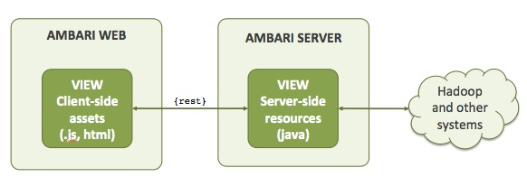
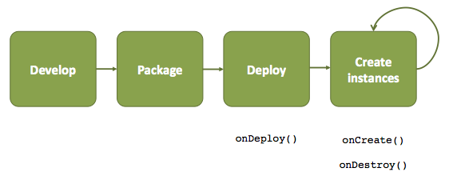

# Views

:::info
This capability is currently under development.
:::info

**Ambari Views** offer a systematic way to plug-in UI capabilities to surface custom visualization, management and monitoring features in Ambari Web. A " **view**" is a way of extending Ambari that allows 3rd parties to plug in new resource types along with the APIs, providers and UI to support them. In other words, a view is an application that is deployed into the Ambari container.


## Useful Resources

Resource | Link
---------|-------
Views Overview  | http://www.slideshare.net/hortonworks/ambari-views-overview
Views Framework API Docs | https://github.com/apache/ambari/blob/trunk/ambari-views/docs/index.md
Views Framework Examples | https://github.com/apache/ambari/tree/trunk/ambari-views/examples

## Terminology

The following section describes the basic terminology associated with views.

Term | Description
---------|-------
View Name     | The name of the view. The view name identifies the view to Ambari.
View Version  | The version of the view. A unique view name can have multiple versions deployed in Ambari.
View Package  | This is the JAR package that contains the **view definition** and all view resources (server-side resources and client-side assets) for a given view version. See [View Package](#View20%Package) for more information on the contents and structure of the package.
View Definition | This defines the view name, version, resources and required/optional configuration parameters for a view. The view definition file is included in the view package. See View Definition for more information on the view definition file syntax and features.
View Instance | An unique instance of a view, that is based on a view definition and specific version that is configured. See Versions and Instances for more information.
View API  | The REST API for viewing the list of deployed views and creating view instances. See View API for more information.
Framework Services | The server-side of the view framework exposes certain services for use with your views. This includes persistence of view instance data and view eventing. See Framework Services for more information.

## Components of a View

A view can consist of **client-side assets** (i.e. the UI that is exposed in Ambari Web) and **server-side resources** (i.e. the classes that expose REST end points). When the view loads into Ambari Web, the view UI can use the view server-side resources as necessary to deliver the view functionality.



### Client-side Assets

The view does not limit or restrict what client-side technologies a view uses. You can package client-side dependencies (such as JavaScript and CSS frameworks) with your view.

### Server-side Resources

A view can expose resources as REST end points to be used in conjunction with the client-side to deliver the functionality of your view application. Thees resources are written in Java and can be anything from a servlet to a regular REST service to an Ambari ResourceProvider (i.e. a special type of REST service that handles some REST capabilities such as partial response and pagination – if you adhere to the Ambari ResourceProvider interface). See [Framework Services](./framework-services.md) for more information on capabilities that the framework exposes on the server-side for views.

:::info
Checkout the **Weather View** as an example of a view that exposes servlet and REST endpoints.

[https://github.com/apache/ambari/tree/trunk/ambari-views/examples/weather-view](https://github.com/apache/ambari/tree/trunk/ambari-views/examples/weather-view)
:::

## View Package

The assets associated with a view are delivered as a JAR package. The **view definition file** must be at the root of the package. UI assets and server-side classes are served from the root. Dependent Java libraries are placed in the `WEB-INF/lib` directory.

```
view.jar
|
|- view.xml
|
|-
|
|- index.html
| |
| |_
|
|_ WEB-INF
  |
  |_ lib/*.jar
```

## Versions and Instances

Multiple versions of a given view can be deployed into Ambari and multiple instances of each view can be created for each version. For example, I can have a view named FILES and deploy versions 0.1.0 and 0.2.0. I can then create instances of each version FILES{0.1.0} and FILES{0.2.0} allowing some Ambari users to have an older version of FILES (0.1.0), and other users to have the newer FILES version (0.2.0). I can also create multiple instances for each version, configuring each differently.


### Instance Configuration Parameters

As part of a view definition, the instance configuration parameters are specified (i.e. "these parameters are needed to configure an instance of this view"). When you create a view instance, you specify the configuration parameters specific to that instance. Since parameters are scoped to a particular view instance, you can have multiple instances of a view, each instance configured differently.

Using the example above, I can create two instances of the FILES{0.2.0} version, one instance that is configured a certain way and the second that is configured differently. This allows some Ambari users to use FILES one way, and other users a different way.

See [Framework Services](./framework-services.md) for more information on instance configuration properties.

## View Lifecycle

The lifecycle of a view is shown below. As you deploy a view and create instances of a view, server-side framework events are invoked. See [Framework Services](./framework-services.md) for more information on capabilities that the framework exposes on the server-side for views.


