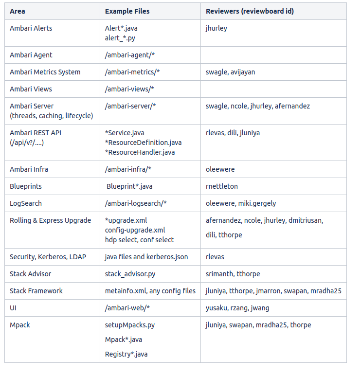

# Code Review Guidelines

Please refer to [How to Contribute](./how-to-contribute.md) for instructions how to submit a code review to Github.

**What makes a good code review?**

- Authors should annotate source code before the review. This makes it easier for devs reviewing your code and may even help you spot bugs before they do.
- Send small code-reviews if possible. Reviewing more than 400 lines per hour diminishes our ability to find defects.
- Reviewing code for more than one hour also reduces our ability to find bugs.
- If possible, try to break up large reviews into separate but functional stages. If you need to temporarily comment out unit tests, do so. Sending gigantic patches means your review will take longer since reviewers need to block out more time to go through it, and you may spend more time revving iterations and rebasing.

We have a global community of committers, so please be mindful that you should **wait at least 24 hours** before merging your pull request even though you may already have the necessary +1.

This encourages others to take an interest in your pull request and helps us find more bugs (it's ok to slow down in order to speed up).

**Always include** **at least two committers that are familiar with that code area**.

If you want to subscribe to code reviews for a particular area, [feel free to edit this section](https://cwiki.apache.org/confluence/display/AMBARI/Code+Review+Guidelines).

