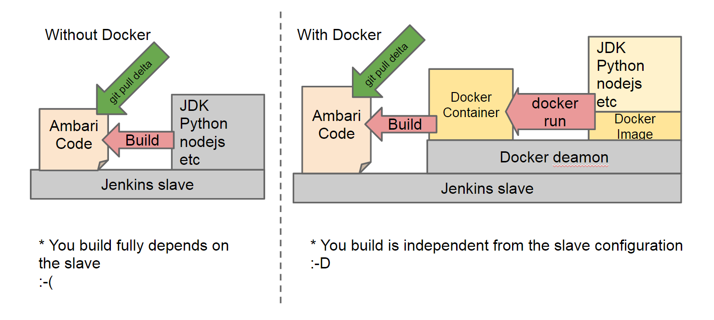

# Development in Docker

## Overview

This page describes how to develop, build and test Ambari on Docker. 

In order to build Ambari, there are a quite few steps to execute and it is a bit cumbersome. You can build an environment in Docker and are good to go!

This is NOT meant for running production level Ambari in Docker (though you can run Ambari and deploy Hadoop in a single Docker container for testing purpose) 



(This is not only about Jenkins slaves but think it is your laptop)

First, we will make a Docker image that has all third party libraries Ambari requires. 

Second, prepare your code on Docker host machine. It can be trunk or a branch, or your developing code or with a patch applied. Note that your code does not reside inside of Docker container, but on the Docker host and we link it by Docker volume (like mount)

And you are ready to go!

### Source code

This code has been migrated to Ambari trunk.

https://github.com/apache/ambari/tree/trunk/dev-support/docker

## Requirements

There are a few system requirements if you want to play with this document.

- Docker https://docs.docker.com/#installation-guides

## Create Docker Image

First thing first, we have to build an Docker image for this solution. This will setup libraries including ones from yum and maven dependencies. In my environment (Centos 6.5 VM with 8GB and 4CPUs) takes 30mins. Good news is this is one time.

```bash
git clone https://github.com/apache/ambari.git
cd ambari
docker build -t ambari/build ./dev-support/docker/docker
```

This is going to build a image named "ambari/build" from configuration files under ./dev-support/docker/docker

## Unit Test

For example our unit test Jenkins job on trunk runs on Docker. If you want to replicate the environment, read this section.

The basic

```bash
cd {ambari_root}
docker run --privileged -h node1.mydomain.com -v $(pwd):/tmp/ambari ambari/build /tmp/ambari/dev-support/docker/docker/bin/ambaribuild.py test -b
```

- 'docker run' is the command to run a container from a image. Which image was run? It is 'ambari/build'
- -h sets a host name in the container. 
- -v is to mount your Ambari code on the host to the container's /tmp. Make sure you are at the Ambari root directory.
- ambaribuild.py runs some script to eventually run 'mvn test' for ambari. 
- -b option is to rebuild the entire source tree. It runs test as is on your host if omitted. 

## Deploy Hadoop

You want to run Ambari and Hadoop to test your improvements that you have just coded on your host. Here is the way!

 
```bash
cd {ambari_root}
docker run --privileged -t -p 80:80 -p 5005:5005 -p 8080:8080 -h node1.mydomain.com --name ambari1 -v $(pwd):/tmp/ambari ambari/build /tmp/ambari-build-docker/bin/ambaribuild.py deploy -b
  
# once your are done
docker kill ambari1 && docker rm ambari1
```

- --privileged is important as ambari-server accessing to /proc/??/exe
- -p 80:80 to ensure you can access to web UI from your host.
- -p 5005 is java debug port
- 'deploy' to build, install rpms and start ambari-server and ambari-agent and deploy Hadoop through blueprint.

You can take a look at https://github.com/apache/ambari/tree/trunk/dev-support/docker/docker/blueprints to see what is actually deployed.

There are a few other parameters you can play.

```bash
cd {ambari_root}
docker run --privileged -t -p 80:80 -p 5005:5005 -p 8080:8080 -h node1.mydomain.com --name ambari1 -v ${AMBARI_SRC:-$(pwd)}:/tmp/ambari ambari/build /tmp/ambari-build-docker/bin/ambaribuild.py [test|server|agent|deploy] [-b] [-s [HDP|BIGTOP|PHD]]
```

- test: mvn test
- server: install and run ambari-server
- agent: install and run ambari-server and ambari-agent
- deploy: install and run ambari-server and ambari-agent, and deploy a hadoop