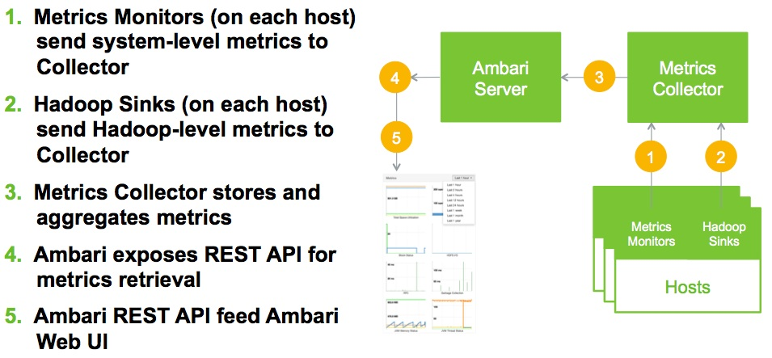

# Metrics

**Ambari Metrics System** ("AMS") is a system for collecting, aggregating and serving Hadoop and system metrics in Ambari-managed clusters.

## Terminology

Term                            | Definition
--------------------------------|-------------------------------------------------------------
Ambari Metrics System (“AMS”)   |   The built-in metrics collection system for Ambari.
Metrics Collector               |   The standalone server that collects metrics, aggregates metrics, serves metrics from the Hadoop service sinks and the Metrics Monitor.
Metrics Monitor                 |   Installed on each host in the cluster to collect system-level metrics and forward to the Metrics Collector.
Metrics Hadoop Sinks            |   Plugs into the various Hadoop components sinks to send Hadoop metrics to the Metrics Collector.

## Architecture
Following image depicts the high level conceptual architecture of the new Ambari Metrics System:

The **Metrics Collector** is daemon that receives data from registered publishers (the Monitors and Sinks). The Collector itself is build using Hadoop technologies such as HBase Phoenix and ATS. The Collector can store data on the local filesystem (referred to as "embedded mode") or use an external HDFS (referred to as "distributed mode").

## Learn More
Browse the following to learn more about the [Ambari Metrics REST API](./metrics-api-specification.md) specification and about advanced [Configuration](./configuration.mdx) of AMS.