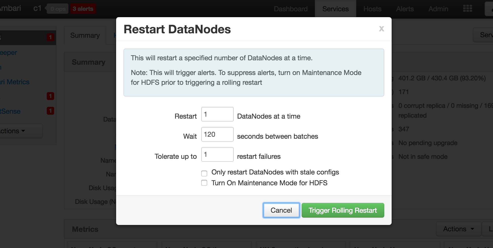

# Troubleshooting

## Cleaning up Ambari Metrics System Data

Following steps would help in cleaning up Ambari Metrics System data in a given cluster.

Important Note:

1. Cleaning up the AMS data would remove all the historical AMS data available
2. The hbase parameters mentioned above are specific to AMS and they are different from the Cluster Hbase parameters

### Step-by-step guide

1. Using Ambari
   * Set AMS to maintenance
   * Stop AMS from Ambari. Identify the following from the AMS Configs screen
      * 'Metrics Service operation mode' (embedded or distributed)
      * hbase.rootdir 
      * hbase.zookeeper.property.dataDir
2. AMS data would be stored in 'hbase.rootdir' identified above. Backup and remove the AMS data.
     * If the Metrics Service operation mode
         * is 'embedded', then the data is stored in OS files. Use regular OS commands to backup and remove the files in hbase.rootdir
         * is 'distributed', then the data is stored in HDFS. Use 'hdfs dfs' commands to backup and remove the files in hbase.rootdir
3. Remove the AMS zookeeper data by backing up and removing the contents of 'hbase.tmp.dir'/zookeeper
4. Remove any Phoenix spool files from 'hbase.tmp.dir'/phoenix-spool folder
5 Restart AMS using Ambari

## Moving Metrics Collector to a new host

1. Stop AMS Service

2. Execute the following API call to Delete Metric Collector. (Replace server-host, cluster-name and host-name with the Metrics Collector host)

```
curl -u admin:admin  -H "X-Requested-By:ambari" -i -X DELETE http://<server-host>:8080/api/v1/clusters/<cluster-name>/hosts/<host-name>/host_components/METRICS_COLLECTOR
```

3. Execute the following API call to add Metrics collector to a new host. (Replace, server-host, cluster-name, host-name)

```
curl -u admin:admin  -H "X-Requested-By:ambari" -i -X POST http://<server-host>:8080/api/v1/clusters/<cluster-name>/hosts/<host-name>/host_components/METRICS_COLLECTOR
```

4. Install the Metrics Collector component from the Host page of the new host.

5. If the AMS is in embedded mode, copy the AMS data from old node to new node.

     * For embedded mode (ams-site: timeline.metrics.service.operation.mode), copy over the hbase.rootdir and tmpdir to new host from the old collector host.
     * For distributed mode, since AMS HBase is writing to HDFS, no change will be necessary. 
     * Ensure that ams:hbase-site:hbase.rootdir and hbase.tmp.dir are pointing to the correct location in the new AMS node
6. Start the Metrics Service.

7. The service daemons will be pointing to the old metrics collector host. Perform a rolling restart of slave components and a normal restart of Master components for them to pick up the new collector host. 

Note : Restart of services is not needed post Ambari-2.5.0 since live collector information is maintained in the cluster zookeeper. 



## Troubleshooting Guide

The following page documents common problems discovered with Ambari Metrics Service and provides a guide for things to look out for and already solved problems.

**Important facts to collect from the system**:

Problems with Metric Collector host
* Output of "rpm -qa | grep ambari" on the collector host. 
* Total available System memory, output of : "free -g"
* Total available disk space and available partitions, output of : "df -h "
* Total number of hosts in the cluster
* Configs: /etc/ams-hbase/conf/hbase-env.sh, /etc/ams-hbase/conf/hbase-site.xml, /etc/ambari-metrics-collector/conf/ams-env.sh, /etc/ambari-metrics-collector/conf/ams-site.xml
* Collector logs: 

```
/var/log/ambari-metrics-collector/ambari-metrics-collector.log, /var/log/ambari-metrics-collector/hbase-ams-master-<host>.log, /var/log/ambari-metrics-collector/hbase-ams-master-<host>.out
Note: Additionally, If distributed mode is enabled, /var/log/ambari-metrics-collector/hbase-ams-zookeeper-<host>.log, /var/log/ambari-metrics-collector/hbase-ams-regionserver-<host>.log
```

* Response to the following URLs -

```
http://<ams-host>:6188/ws/v1/timeline/metrics/metadata
http://<ams-host>:6188/ws/v1/timeline/metrics/hosts 
```

* The response will be JSON and can be attached as a file.
* From AMS HBase Master UI - http://&lt;METRICS_COLLECTOR_HOST&gt;:61310
 

    * Region Count
    * StoreFile Count
    * JMX Snapshot - http://&lt;METRICS_COLLECTOR_HOST&gt;:61310/jmx
    

**Problems with Metric Monitor host**

```
Monitor log file: /etc/ambari-metrics-monitor/ambari-metrics-monitor.out
```

**Check out [Configurations - Tuning](https://cwiki.apache.org/confluence/display/AMBARI/Configurations+-+Tuning) for scale issue troubleshooting.**

**Issue 1: AMS HBase process slow disk writes**

The symptoms and resolutions below address the **embedded** mode of AMS only.

_Symptoms_:

Behavior|How to detect
--------|--------------
High CPU usage | HBase process on Collector host taking up close to 100% of every core
HBase Log: Compaction times | grep hbase-ams-master-&lt;host&gt;.log | grep "Finished memstore flush"<br></br>This yields MB written in X milliseconds, generally 128 MBps and above is average speed unless the disk is contended.<br></br>Also this search reveals how many times compaction ran per minute. A value greater than 6 or 8 is a warning that write volume is far greater than what HBase can hold in memory
HBase Log: ZK timeout  | HBase crashes saying zookeeper session timed out. This happens because in embedded mode the zk session timeout is limited to max of 30 seconds (HBase issue: fix planned for 2.1.3).<br></br>The cause is again slow disk reads.
Collector Log : "waiting for some tasks to finish" | ambari-metric-collector log shows messages where AsyncProcess writes are queued up

_Resolutions_:

Configuration Change|Description
--------|-----------------------
ams-hbase-site :: hbase.rootdir | Change this path to a disk mount that is not heavily contended.
ams-hbase-ste :: hbase.tmp.dir  | Change this path to a location different from hbase.rootdir
ams-hbase-env :: hbase_master_heapsize<br></br>ams-hbase-site :: hbase.hregion.memstore.flush.size | Bump this value up so more data is held in memory to address I/O speeds.<br></br>If heap size is increased and resident memory usage does not go up, this parameter can be changed to address how much data can be stored in a memstore per Region. Default is set to 128 MB. The size is in bytes.<br></br>Be careful with modifying this value, generally limit the setting between 64 MB (small heap with fast disk write), to 512 MB (large heap > 8 GB, and average write speed), since more data held in memory means longer time to write it to disk during a Flush operation.

**Issue 2: Ambari Metrics take a long time to load**

_Symptoms_:

Behavior|How to detect
--------|--------------
Graphs: Loading time too long<br></br>Graphs: No data available | Check out service pages / host pages for metric graphs
Socket read timeouts | ambari-server.log shows: Error message saying socket timeout for metrics
Ambari UI slowing down  | Host page loading time is high, heatmaps do not show data<br></br>Dashboard loading time is too high<br></br>Multiple sessions result in slowness

_Resolutions_:

Upgrade to 2.1.2+ is highly recommended.

Following is a list of fixes in 2.1.2 release that should greatly help to alleviate the slow loading and timeouts:

https://issues.apache.org/jira/browse/AMBARI-12654

https://issues.apache.org/jira/browse/AMBARI-12983

https://issues.apache.org/jira/browse/AMBARI-13108

## [Known Issues](https://cwiki.apache.org/confluence/display/AMBARI/Known+Issues)