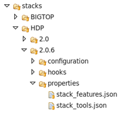

# Stack Properties

Similar to stack configurations, most properties are defined at the service level, however there are global properties which can be defined at the stack-version level affecting across all services.

Some examples are: [stack-selector and conf-selector](https://github.com/apache/ambari/blob/trunk/ambari-server/src/main/resources/stacks/HDP/2.0.6/properties/stack_tools.json#L2) specific names or what [stack versions certain stack features](https://github.com/apache/ambari/blob/trunk/ambari-server/src/main/resources/stacks/HDP/2.0.6/properties/stack_features.json#L5) are supported by. Most of these properties were introduced in Ambari 2.4 version in the effort of parameterize stack information and facilitate the reuse of common-services code by other distributions.


Such properties can be defined in .json format in the [properties folder](https://github.com/apache/ambari/tree/trunk/ambari-server/src/main/resources/stacks/HDP/2.0.6/properties) of the stack.



# Stack features

Stacks can support different features depending on their version, for example: upgrade support, NFS support, support for specific new components (such as Ranger, Phoenix )...


Stack featurization was added as part of the HDP stack configurations on [HDP/2.0.6/configuration/cluster-env.xml](http://github.com/apache/ambari/blob/trunk/ambari-server/src/main/resources/stacks/HDP/2.0.6/configuration/cluster-env.xml), introducing a new stack_features property which value is processed in the stack engine from an external property file.

```xml
<!-- Define stack_features property in the base stack. DO NOT override this property for each stack version -->
<property>
  <name>stack_features</name>
  <value/>
  <description>List of features supported by the stack</description>
  <property-type>VALUE_FROM_PROPERTY_FILE</property-type>
  <value-attributes>
    <property-file-name>stack_features.json</property-file-name>
    <property-file-type>json</property-file-type>
    <read-only>true</read-only>
    <overridable>false</overridable>
    <visible>false</visible>
  </value-attributes>
  <on-ambari-upgrade add="true"/>
</property>
```

Stack Features properties are defined in [stack_features.json](https://github.com/apache/ambari/blob/trunk/ambari-server/src/main/resources/stacks/HDP/2.0.6/properties/stack_features.json) file under /HDP/2.0.6/properties. These features support is now available for access at service-level code to change certain service behaviors or configurations. This is an example of features described in stack_features.jon file:


```json
"stack_features": [
    {
      "name": "snappy",
      "description": "Snappy compressor/decompressor support",
      "min_version": "2.0.0.0",
      "max_version": "2.2.0.0"
    },
    {
      "name": "lzo",
      "description": "LZO libraries support",
      "min_version": "2.2.1.0"
    },
    {
      "name": "express_upgrade",
      "description": "Express upgrade support",
      "min_version": "2.1.0.0"
    },
    {
      "name": "rolling_upgrade",
      "description": "Rolling upgrade support",
      "min_version": "2.2.0.0"
    }
  ]
}
```

where min_version/max_version are optional constraints.

Feature constants, matching features names, such has ROLLING_UPGRADE = "rolling_upgrade" has been added to a new StackFeature class in [resource_management/libraries/functions/constants.py](https://github.com/apache/ambari/blob/trunk/ambari-common/src/main/python/resource_management/libraries/functions/constants.py#L38)


```python
class StackFeature:
"""
  Stack Feature supported
"""
  SNAPPY = "snappy"
  LZO = "lzo"
  EXPRESS_UPGRADE = "express_upgrade"
  ROLLING_UPGRADE = "rolling_upgrade"
```

Additionally, corresponding helper functions has been introduced in [resource_management/libraries/functions/stack_fetaures.py](https://github.com/apache/ambari/blob/trunk/ambari-common/src/main/python/resource_management/libraries/functions/stack_features.py) to parse the .json file content and called from service code to check if the stack supports the specific feature.

This is an example where the new stack featurization design is used in service code:

```python
if params.version and check_stack_feature(StackFeature.ROLLING_UPGRADE, params.version):
      conf_select.select(params.stack_name, "hive", params.version)
      stack_select.select("hive-server2", params.version)
```

# Stack Tools


Similar to stack features, stack-selector and conf-selector tools are now stack-driven instead of hardcoding hdp-select and conf-select. They are defined in [stack_tools.json](https://github.com/apache/ambari/blob/trunk/ambari-server/src/main/resources/stacks/HDP/2.0.6/properties/stack_tools.json) file under /HDP/2.0.6/properties

And declared as part of the HDP stack configurations as a new property on [/HDP/2.0.6/configuration/cluster-env.xml](https://github.com/apache/ambari/blob/trunk/ambari-server/src/main/resources/stacks/HDP/2.0.6/configuration/cluster-env.xml)


```xml
<!-- Define stack_tools property in the base stack. DO NOT override this property for each stack version -->
<property>
  <name>stack_tools</name>
  <value/>
  <description>Stack specific tools</description>
  <property-type>VALUE_FROM_PROPERTY_FILE</property-type>
  <value-attributes>
    <property-file-name>stack_tools.json</property-file-name>
    <property-file-type>json</property-file-type>
    <read-only>true</read-only>
    <overridable>false</overridable>
    <visible>false</visible>
  </value-attributes>
  <on-ambari-upgrade add="true"/>
</property>
```

Corresponding helper functions have been added in [resource_management/libraries/functions/stack_tools.py](https://github.com/apache/ambari/blob/trunk/ambari-common/src/main/python/resource_management/libraries/functions/stack_tools.py). These helper functions are used to remove hardcodings in resource_management library.
