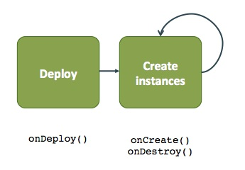
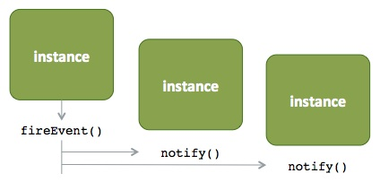

# Framework Services

This section describes the framework services that are available for views.


## ViewContext

The view server-side resources have access to a [ViewContext](https://github.com/apache/ambari/blob/trunk/ambari-views/src/main/java/org/apache/ambari/view/ViewContext.java) object. The view context provides information about the current authenticated user, the view definition, the instance configuration properties, instance data and the view controller.

```java
/**
   * The view context.

   */
  @Inject
  ViewContext context;
```

## Instance Data

The view framework exposes a way to store key/value pair "instance data". This data is scoped to a given view instance and user. Instance data is meant to be used for information such as "user prefs" or other lightweight information that supports the experience of your view application. You can access the instance data get and put methods from the [ViewContext](https://github.com/apache/ambari/blob/trunk/ambari-views/src/main/java/org/apache/ambari/view/ViewContext.java) object.

Checkout the **Favorite View** for example usage of the instance data API.

[https://github.com/apache/ambari/tree/trunk/ambari-views/examples/favorite-view](https://github.com/apache/ambari/tree/trunk/ambari-views/examples/favorite-view)

```java
/**
 * Context object available to the view components to provide access to
 * the view and instance attributes as well as run time information about
 * the current execution context.

 */
public interface ViewContext {

 /**
   * Save an instance data value for the given key.

   *
   * @param key    the key
   * @param value  the value
   *
   * @throws IllegalStateException if no instance is associated
   */
  public void putInstanceData(String key, String value);
  /**
   * Get the instance data value for the given key.

   *
   * @param key  the key
   *
   * @return the instance data value; null if no instance is associated
   */
  public String getInstanceData(String key);

}
```

## Instance Configuration Properties

The instance configuration properties (set when you created your view instance) are accessible from the view context:

```java
viewContext.getProperties();
```

Configuration properties also supports a set of pre-defined **variables** that will be replaced when you read the property from the view context. For example, if your view requires a configuration parameter "hdfs.file.path" and that path is going to be set based on the username, when you configure the view instance, set the configuration property like so:

```
"hdfs.file.path" : "/this/is/some/path/${username}"
```

When you get this property from the view context, the `${username}` variable will be replaced automatically.

```java
viewContext.getProperties().get("hdfs.file.path") returns "/this/is/some/path/pramod"
```

Instance parameters support the following pre-defined variables: `${username}`, `${viewName}` and `${instanceName}`

## Events

Events are an important component of the views framework. Events allow the view to interact with the framework on lifecycle changes (i.e. "Framework Events") such as deploy, create and destroy. As well, once a user has collection of views available, eventing allows the views to communicate with other views (i.e. "View Events").

### Framework Events

To register to receive framework events, in the `view.xml`, specify a `<view-class>this.is.my.view-clazz</view-class>` which is a class that implements the [View](https://github.com/apache/ambari/blob/trunk/ambari-views/src/main/java/org/apache/ambari/view/View.java) interface.

 

Event | Description
---------|-------
onDeploy() | Called when a view is deployed.
onCreate() | Called when a view instance is created.
onDestroy() | Called when a view instance is destroy.

### Views Events

Views can pass events between views. Obtain the [ViewController](https://github.com/apache/ambari/blob/trunk/ambari-views/src/main/java/org/apache/ambari/view/ViewController.java) object that allows you to **register listeners** for view events and to **fire events** for other listeners. A view can register an event [Listener](https://github.com/apache/ambari/blob/trunk/ambari-views/src/main/java/org/apache/ambari/view/events/Listener.java) (via the [ViewController](https://github.com/apache/ambari/blob/trunk/ambari-views/src/main/java/org/apache/ambari/view/ViewController.java)) for other views by **view name**, or by **view name + version**. When an [Event](http://github.com/apache/ambari/blob/trunk/ambari-views/src/main/java/org/apache/ambari/view/events/Event.java) is fired from the source view, all registered listeners will receive the event.



1. Obtain the view controller and register a listener.

```java
viewContext.getViewController().registerListener(...);
```
2. Fire the event. `viewContext.getViewController().fireEvent(...);`

3. The framework will notify all registered listeners. The listener implementation can process the event as appropriate.  `listener.notify(...)`
