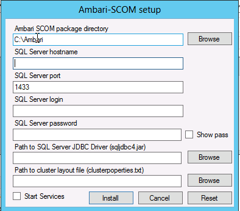

# Installation

## Prerequisite Software 

Setting up Ambari SCOM assumes the following prerequisite software:

* Ambari SCOM 1.0
  - Apache Hadoop 1.x cluster (HDFS and MapReduce) 1
* Ambari SCOM 2.0
  - Apache Hadoop 2.x cluster (HDFS and YARN/MapReduce) 2
* JDK 1.7
* Microsoft SQL Server 2012
* Microsoft JDBC Driver 4.0 for SQL Server 3
* Microsoft System Center Operations Manager (SCOM) 2012 SP1 or later
* System Center Monitoring Agent installed on **Watcher Node** 4

1 _Ambari SCOM_ 1.0 has been tested with a Hadoop cluster based on **Hortonworks Data Platform 1.3 for Windows** ("[HDP 1.3 for Windows](http://hortonworks.com/products/releases/hdp-1-3-for-windows/)")

2 _Ambari SCOM_ 2.0 has been tested with a Hadoop cluster based on **Hortonworks Data Platform 2.1 for Windows** ("[HDP 2.1 for Windows](http://docs.hortonworks.com/HDPDocuments/HDP2/HDP-2.1-Win-latest/bk_installing_hdp_for_windows/content/win-getting-ready.html)")

3 Obtain the _Microsoft JDBC Driver 4.0 for SQL Server_ JAR file (`sqljdbc4.jar`) at [http://technet.microsoft.com/en-us/library/ms378749.aspx](http://technet.microsoft.com/en-us/library/ms378749.aspx)

4 See Microsoft TechNet topic for [Managing Discovery and Agents](http://technet.microsoft.com/en-us/library/hh212772.aspx). Minimum Agent requirements _.NET 4_ and _PowerShell 2.0 + 3.0_

## Package Contents 

```
├─ ambari-scom- _**version**_.zip
├── README.md
├── server.zip
├── metrics-sink.zip
├── mp.zip
└── ambari-scom.msi
```

File | Name | Description
-----|------|-------------
server.zip | Server Package | Contains the required software for configuring the Ambari SCOM Server software. 
metrics-sink.zip | Metrics Sink Package | Contains the required software for manually configuring SQL Server and the Hadoop Metrics Sink.
ambari-scom.msi | MSI Installer | The Ambari SCOM MSI Installer for configuring the Ambari SCOM Server and Hadoop Metrics Sink
mp.zip | Management Pack Package | Contains the Ambari SCOM Management Pack software.

## Ambari SCOM Server Installation

:::caution
The **Ambari SCOM Management Pack** must connect to an Ambari SCOM Server to retrieve cluster metrics. Therefore, you need to have an Ambari SCOM Server running in your cluster. If you have already installed your Hadoop cluster (including the Ganglia Service) with Ambari (minimum **Ambari 1.5.1 for SCOM 2.0.0**) and have an Ambari Server already running + managing your Hadoop 1.x cluster, you can use that Ambari Server and point the **Management Pack** that host. You can proceed directly to [Installing Ambari SCOM Management Pack](#id-2installation-mgmtpack) and skip these steps to install an Ambari SCOM Server. If you do not have an Ambari Server running + managing your cluster, you **must** install an Ambari SCOM Server using one of the methods described below.
:::

The following methods are available for installing Ambari SCOM Server:

* **Manual Installation** - This installation method requires you to configure the SQL Server database, setup the Ambari SCOM Server and configure the Hadoop Metrics Sink. This provides the most flexible install option based on your environment.
* **MSI Installation** - This installation method installs the Ambari SCOM Server and configures the Hadoop Metrics Sink on all hosts in the cluster automatically using an MSI Installer. After launching the MSI, you provide information about your SQL Server database and the cluster for the installer to handle configuration. 

## Manual Installation 

### Configuring SQL Server

1. Configure an existing SQL Server instance for "mixed mode" authentication.

2. Confirm SQL Server is installed with TCP/IP active and enabled. (default port: 1433)
3. Create a user and password. Remember this user and password as this will be the account used by the Hadoop metrics interface for capturing metrics. (default user: sa)
4. Extract the contents of the `metrics-sink.zip` package to obtain the DDL script.

5. Create the Ambari SCOM database schema by running the `Hadoop-Metrics-SQLServer-CREATE.ddl` script.

:::info
The Hadoop Metrics DDL script will create a database called "HadoopMetrics".
:::

### Configuring Hadoop Metrics Sink 

#### Preparing the Metrics Sink

1. Extract the contents of the `metrics-sink.zip` package to obtain the `metrics-sink-<strong><em>version</em></strong>.jar` file.

2. Obtain the _Microsoft JDBC Driver 4.0 for SQL Server_ `sqljdbc4.jar` file.

3. Copy `sqljdbc4.jar` and `metrics-sink-version.jar` to each host in the cluster. For example, copy to `C:\Ambari\metrics-sink-version.jar` and `C:\Ambari\sqljdbc4.jar`
on each host.

#### Setup Hadoop Metrics2 Interface

1. On each host in the cluster, setup the Hadoop metrics2 interface to use the `SQLServerSink`.

Edit the `hadoop-metrics2.properties` file (located in the `<strong><em>{C:\hadoop\install\dir}</em></strong>\bin` folder of each host in the cluster):

```
*.sink.sql.class=org.apache.hadoop.metrics2.sink.SqlServerSink

namenode.sink.sql.databaseUrl=jdbc:sqlserver://[server]:[port];databaseName=HadoopMetrics;user=[user];password=[password]
datanode.sink.sql.databaseUrl=jdbc:sqlserver://[server]:[port];databaseName=HadoopMetrics;user=[user];password=[password]
jobtracker.sink.sql.databaseUrl=jdbc:sqlserver://[server]:[port];databaseName=HadoopMetrics;user=[user];password=[password]
tasktracker.sink.sql.databaseUrl=jdbc:sqlserver://[server]:[port];databaseName=HadoopMetrics;user=[user];password=[password]
maptask.sink.sql.databaseUrl=jdbc:sqlserver://[server]:[port];databaseName=HadoopMetrics;user=[user];password=[password]
reducetask.sink.sql.databaseUrl=jdbc:sqlserver://[server]:[port];databaseName=HadoopMetrics;user=[user];password=[password]
```

:::info
_Where:_

* _server = the SQL Server hostname_
* _port = the SQL Server port (for example, 1433)_
* _user = the SQL Server user (for example, sa)_
* _password = the SQL Server password (for example, BigData1)_
:::

1. Update the Java classpath for each Hadoop service to include the `metrics-sink-<strong><em>version</em></strong>.jar` and `sqljdbc4.jar` files.


    - Example: Updating the Java classpath for _HDP for Windows_ clusters

      The `service.xml` files will be located in the `C:\hadoop\install\dir\bin` folder of each host in the cluster. The Java classpath is specified for each service in the `<arguments>` element of the `service.xml` file. For example, to update the Java classpath for the `NameNode` component, edit the `C:\hadoop\bin\namenode.xml` file.

        ```
        ...
        
        ... -classpath ...;C:\Ambari\metrics-sink-1.5.1.2.0.0.0-673.jar;C:\Ambari\sqljdbc4.jar ...
        
        ...
        
        ```

2. Restart Hadoop for these changes to take affect.

#### Verify Metrics Collection

1. Confirm metrics are being captured in the SQL Server database by querying the `MetricRecord` table:

```sql
select * from HadoopMetrics.dbo.MetricRecord
```
:::info
In the above SQL statement, `HadoopMetrics` is the database name.
:::

### Installing and Configuring Ambari SCOM Server

#### Running the Server

1. Designate a machine in the cluster to run the Ambari SCOM Server.

2. Extract the contents of the `server.zip` package to obtain the Ambari SCOM Server packages.

```
├── ambari-scom-server- **_version_**-conf.zip
├── ambari-scom-server- **_version_**-lib.zip
└── ambari-scom-server- **_version_**.jar
```

3. Extract the contents of the `ambari-scom-server-version-lib.zip` package to obtain the Ambari SCOM dependencies.

4. Extract the contents of the `ambari-scom-server-version-conf.zip` package to obtain the Ambari SCOM configuration files.

5. From the configuration files, edit the `ambari.properties` file:

```
scom.sink.db.driver=com.microsoft.sqlserver.jdbc.SQLServerDriver
scom.sink.db.url=jdbc:sqlserver://[server]:[port];databaseName=HadoopMetrics;user=[user];password=[password]
```

:::info
_Where:_
  - _server = the SQL Server hostname_
  - _port = the SQL Server port (for example, 1433)_
  - _user = the SQL Server user (for example, sa)_
  - _password = the SQL Server password (for example, BigData1)_
:::

6. Run the `org.apache.ambari.scom.AmbariServer` class from the Java command line to start the Ambari SCOM Server. 

:::info
Be sure to include the following in the classpath:
  - `ambari-scom-server-version.jar` file
  - configuration folder containing the Ambari SCOM configuration files
  - lib folder containing the Ambari SCOM dependencies
  - folder containing the `clusterproperties.txt` file from the Hadoop install. For example, `c:\hadoop\install\dir`
  - `sqljdbc4.jar` SQLServer JDBC Driver file
::
  
For example:

```bash
java -server -XX:NewRatio=3 -XX:+UseConcMarkSweepGC -XX:-UseGCOverheadLimit -XX:CMSInitiatingOccupancyFraction=60 -Xms512m -Xmx2048m -cp "c:\ambari-scom\server\conf;c:\ambari-scom\server\lib\*;c:\jdbc\sqljdbc4.jar;c:\hadoop\install\dir;c:\ambari-scom\server\ambari-scom-server-1.5.1.2.0.0.0-673.jar" org.apache.ambari.scom.AmbariServer
```

:::info
In the above command, be sure to replace the Ambari SCOM version in the `ambari-scom-server-version.jar` and replace `c:\hadoop\install\dir` with the folder containing the `clusterproperties.txt` file.
:::

#### Verify the Server API

1. From a browser access the API

```
http://[ambari-scom-server]:8080/api/v1/clusters
```
2. Verify that metrics are being reported.

```
http://[ambari-scom-server]:8080/api/v1/clusters/ambari/services/HDFS/components/NAMENODE
```

## MSI Installation

### Configuring SQL Server

1. Configure an existing SQL Server instance for "mixed mode" authentication.

2. Confirm SQL Server is installed with TCP/IP active and enabled. (default port: 1433)
3. Create a user and password. (default user: sa)

### Running the MSI Installer

1. Designate a machine in the cluster to run the Ambari SCOM Server.

2. Extract the contents of the `server.zip` package to obtain the Ambari SCOM Server packages.

3. Run the `ambari-scom.msi` installer. The "Ambari SCOM Setup" dialog appears:

     

4. Provide the following information: 

Field | Description
------|------------
Ambari SCOM package directory | The directory where the installer will place the Ambari SCOM Server packages. For example: C:\Ambari
SQL Server hostname | The hostname of the SQL Server instance for Ambari SCOM Server to use to store Hadoop metrics.
SQL Server port | The port of the SQL Server instance.
SQL Server login | The login username.
SQL Server password | The login password
Path to SQL Server JDBC Driver (sqljdbc4.jar) | The path to the JDBC Driver JAR file.
Path to the cluster layout file (clusterproperties.txt) | The path to the cluster layout properties file.

5. You can optionally select to Start Services
6. Click Install
7. After completion, links are created on the desktop to "Start Ambari SCOM Server", "Browse Ambari API" and "Browse Ambari API Metrics". After starting the Ambari SCOM Server, browse the API and Metrics to confirm the server is working properly.

:::info
The MSI installer installation log can be found at `C:\AmbariInstallFiles\AmbariSetupTools\ambari.winpkg.install.log`
:::

### Installing Ambari SCOM Management Pack

:::info
Before installing the Management pack, be sure to install the Ambari SCOM Server using the Ambari SCOM Server Installation instructions.
:::

#### Import the Management Pack

Perform the following to import the Ambari SCOM Management Pack into System Center Operations Manager.

1. Extract the contents of the `mp.zip` package to obtain the Ambari SCOM management pack (`.mpb`) files.

2. Ensure Windows Server 2012 running SCOM with SQL Server (full text search).

3. Open System Center Operations Manager.

4. Go to Administration -> Management Packs.

5. From the Tasks panel, select Import Management Packs...

6. In the Import Management Packs dialog, select Add -> Add from disk...

7. You are prompted to search the Online Catalog. Click "No".

8. Browse for the Ambari SCOM management pack files.

9. Select the following files:

```
Ambari.SCOM.Monitoring.mpb
Ambari.SCOM.Management.mpb
Ambari.SCOM.Presentation.mpb
```
10. Click "Open"
11. Review the Import list and click "Install".

12. The Ambari SCOM Management Pack installation will start.

:::info
The Ambari SCOM package also includes `AmbariSCOMManagementPack.msi` which is an alternative packaging of the `mp.zip`. This MSI is being made in **beta** form in this release.
:::

#### Create Run As Account

Perform the following to configure a account to use when the Ambari SCOM Management Pack talks to the Ambari SCOM Server.

1. After Importing the Management Pack is complete, go to Administration -> Run As Configuration -> Accounts.

2. In the Tasks panel, select "Create Run as Account..."
3. You are presented with the Create Run As Account Wizard.

4. Go thru the wizard, select Run As account type "Basic Authentication".

5. Give the account a Display name and click "Next".

6. Enter the account name and password for the Ambari SCOM Server. This account will be used to connect to the Ambari SCOM Server to access the Ambari REST API. Default is account name is "admin" and password is "admin".

7. Click "Next"
8. Select the "Less secure" distribution security option.

9. Click "Next" and complete the wizard.

#### Configure the Management Pack

Perform the following to configure the Ambari SCOM Management Pack to talk to the Ambari SCOM Server.

1. Go to Authoring -> Management Pack Templates -> Ambari SCOM
2. In the Tasks panel, select "Add Monitoring Wizard".

3. Select monitoring type "Ambari SCOM"
4. Provide a name and select the destination management pack.

5. Provide the Ambari URI with is the address of the Ambari SCOM Server in the format:

```
http://[ambari-scom-server]:8080/api/
```

:::info
In the above Ambari URI, `ambari-scom-server` is the Ambari SCOM Server.
:::

6. Select the Run As Account that you created in Create Run As Account.

7. Select "Watcher Node". If node is not listed, click "Add" and browse for the node. Click "Next".

8. Complete the Add Monitoring Wizard and proceed to the Monitoring Scenariosfor information on using the management pack.

#### Best Practice: Create Management Pack for Customizations

By default, Operations Manager saves all customizations such as overrides to the **Default Management Pack**. As a best practice, you should instead create a separate management pack for each sealed management pack you want to customize.

When you create a management pack for the purpose of storing customized settings for a sealed management pack, it is helpful to base the name of the new management pack on the name of the management pack that it is customizing, such as **Ambari SCOM Customizations**.

Creating a new management pack for storing customizations of each sealed management pack makes it easier to export the customizations from a test environment to a production environment. It also makes it easier to delete a management pack, because you must delete any dependencies before you can delete a management pack. If customizations for all management packs are saved in the **Default Management Pack** and you need to delete a single management pack, you must first delete the **Default Management Pack**, which also deletes customizations to other management packs.

## Monitoring Scenarios

[Monitoring Scenarios](https://cwiki.apache.org/confluence/display/AMBARI/3.+Monitoring+Scenarios)