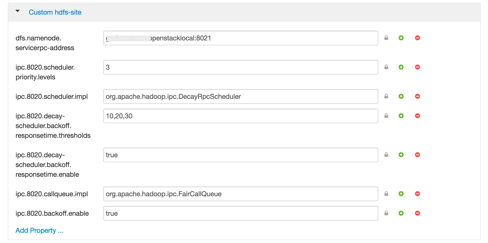

# Configuration

## Metrics Collector

Configuration Type| File Path                                    | Comment
---------------|-------------------------------------------------|----------------------------------------
ams-site       | /etc/ambari-metrics-collector/conf/ams-site.xml |Settings that control the API daemon and the aggregator threads.
ams-env        | /etc/ambari-metrics-collector/conf/ams-env.sh   |Memory / PATH settings for the API daemon
ams-hbase-site | /etc/ams-hbase/conf/hbase-site.xml<br></br>/etc/ambari-metrics-collector/conf/hbase-site.xml |Settings for the HBase storage used for the metrics data.
ams-hbase-env  | /etc/ams-hbase/conf/hbase-env.sh  |Memory / PATH settings for the HBase storage.<br></br>**Note**: In embedded more, the heap memory setting for master and regionserver is summed up as total memory for single HBase daemon.

## Metrics Monitor

Configuration Type| File Path                                    | Comment
---------------|-------------------------------------------------|----------------------------------------
ams-env         |/etc/ambari-metrics-monitor/conf/ams-env.sh         |Used for log and pid dir modifications, this is the same configuration as above, common to both components.
metric_groups   |/etc/ambari-metrics-monitor/conf/metric_groups.conf |Not available in the UI. Used to control what **HOST/SYSTEM** metrics are reported.
metric_monitor  |/etc/ambari-metrics-monitor/conf/metric_monitor.ini |Not available in the UI. Settings for the monitor daemon.

## Metric Collector - ams-site - Configuration details

* Modifying retention interval for time aggregated data. Refer to Aggregation section for more information on aggregation: API spec
(Note: In Ambari 2.0 and 2.1, the Phoenix version does not support Alter TTL queries. So these can be modified from the UI, only at install time. Please refer to Known Issues section for workaround.)

Configuration Type| File Path                                    | Comment
---------------|-------------------------------------------------|----------------------------------------
timeline.metrics.host.aggregator.ttl        |86400   |1 minute resolution data purge interval. Default is 1 day.
timeline.metrics.host.aggregator.minute.ttl |604800  |Host based X minutes resolution data purge interval. Default is 7 days.<br></br>(X = configurable interval, default interval is 2 minutes)
timeline.metrics.host.aggregator.hourly.ttl     |2592000   |Host based hourly resolution data purge interval. Default is 30 days.
timeline.metrics.host.aggregator.daily.ttl      |31536000  |Host based daily resolution data purge interval. Default is 1 year.
timeline.metrics.cluster.aggregator.minute.ttl  |2592000   |Cluster wide minute resolution data purge interval. Default is 30 days.
timeline.metrics.cluster.aggregator.hourly.ttl  |31536000  |Cluster wide hourly resolution data purge interval. Default is 1 year.
timeline.metrics.cluster.aggregator.daily.ttl   |63072000  |Cluster wide daily resolution data purge interval. Default is 2 years.
**Note**: The precision table at 1 minute resolution stores raw precision data for 1 day, when user queries for past 1 hour of data, the AMS API returns raw precision data.

* Modifying the aggregation intervals for HOST and CLUSTER aggregators.
On wake up the aggregator threads resume from (last run time + interval) as long as last run time is not too old.

Property| Default Value Path                                    | Description
---------------|-------------------------------------------------|----------------------------------------
timeline.metrics.host.aggregator.minute.interval    |120   |Time in seconds to sleep for the minute resolution host based aggregator. Default resolution is 2 minutes.
timeline.metrics.host.aggregator.hourly.interval    |3600  |Time in seconds to sleep for the hourly resolution host based aggregator. Default resolution is 1 hour.
timeline.metrics.host.aggregator.daily.interval     |86400 |Time in seconds to sleep for the day resolution host based aggregator. Default resolution is 24 hours.
timeline.metrics.cluster.aggregator.minute.interval |120   |Time in seconds to sleep for the minute resolution cluster wide aggregator. Default resolution is 2 minutes.
timeline.metrics.cluster.aggregator.hourly.interval |3600  |Time in seconds to sleep for the hourly resolution cluster wide aggregator. Default is 1 hour.
timeline.metrics.cluster.aggregator.daily.interval  |86400 |Time in seconds to sleep for the day resolution cluster wide aggregator. Default is 24 hours.

* Modifying checkpoint information. The aggregators store the timestamp or last run time on local FS.
After reading last run time, the aggregator thread decides to aggregate as long as the (currentTime - lastRunTime) < multipler * aggregation_interval.
The multiplier is configurable for each aggregator.

Property | Default Value                                  | Description
---------------|-------------------------------------------------|----------------------------------------
timeline.metrics.host.aggregator.minute.checkpointCutOffMultiplier  |2 |Multiplier value * interval = Max allowed checkpoint lag. Effectively if aggregator checkpoint is greater than max allowed checkpoint delay,the checkpoint will be discarded by the aggregator.
timeline.metrics.host.aggregator.hourly.checkpointCutOffMultiplier    |2 |Same as above
timeline.metrics.host.aggregator.daily.checkpointCutOffMultiplier     |1 |Same as above
timeline.metrics.cluster.aggregator.minute.checkpointCutOffMultiplier |2 |Same as above
timeline.metrics.cluster.aggregator.hourly.checkpointCutOffMultiplier |2 |Same as above
timeline.metrics.cluster.aggregator.daily.checkpointCutOffMultiplier  |1 |Same as above
timeline.metrics.aggregator.checkpoint.dir  |/var/lib/ambari-metrics-collector/checkpoint  |Directory to store aggregator checkpoints. Change to a permanent location so that checkpoint are not lost.

* Other important configuration properties


Property | Default Value                                  | Description
---------------|-------------------------------------------------|----------------------------------------
timeline.metrics.host.aggregator.*.disabled |false |Disable host based * aggregations. ( * => minute/hourly/daily)
timeline.metrics.cluster.aggregator.*.disabled  |false |Disable cluster based * aggregations. ( * => minute/hourly/daily)
timeline.metrics.cluster.aggregator.minute.timeslice.interval |30  |Lowest resolution of desired data for cluster level minute aggregates.
timeline.metrics.hbase.data.block.encoding  |FAST_DIFF| Codecs are enabled on a table by setting the DATA_BLOCK_ENCODING property. Default encoding is FAST_DIFF. This can be changed only before creating tables.
timeline.metrics.hbase.compression.scheme |SNAPPY  |Compression codes need to be installed and available before setting the scheme. Default compression is SNAPPY. Disable by setting to None. This can be changed only before creating tables.
timeline.metrics.service.default.result.limit |5760  |Max result limit on number of rows returned. Calculated as follows: 4 aggregate metrics/min * 60 * 24: Retrieve aggregate data for 1 day.
timeline.metrics.service.checkpointDelay  |60  |Time in seconds to sleep on the first run or when the checkpoint is too old.
timeline.metrics.service.resultset.fetchSize        |2000                       |JDBC resultset prefect size for aggregator queries.
timeline.metrics.service.cluster.aggregator.appIds  |datanode,nodemanager,hbase |List of application ids to use for aggregating host level metrics for an application. Example: bytes_read across Yarn Nodemanagers.

## Configuring Ambari Metrics service in distributed mode

In distributed mode, Metric Collector writes go to HDFS of the cluster. Currently distributed mode does not support multi-mode Metric Collector, however the plan is to allow Metric Collector to scale horizontally to allow a multi-node HBase storage layer.

**Note**: Make sure there is a local Datanode hosted with the Collector, it provides AMS HBase the distinct advantage of write and reads sharded across the data volumes available to the DN.

Following steps need to be performed either at install time or after deploy to configure Metric Collector in distributed mode. Note: If configuring after install, the data will not be automatically copied over to HDFS.

1. Edit ams-site, Set timeline.metrics.service.operation.mode = distributed
2. Edit ams-hbase-site,
      - Set hbase.rootdir = hdfs://namenode-host;:8020/user/ams/hbase [ If NN HA is enabled,     hdfs://nameservice-id/user/ams/hbase ]
      (Note: /user/ams/hbase here is the directory where metric data will be stored in HDFS)
      - Set hbase.cluster.distributed = true
      - Add dfs.client.read.shortcircuit = true (This is an optimization with a local DN present)
3. Restart Metrics Collector

**Note**: In Ambari 2.0.x, there is a bug in deploying AMS in distributed mode, if Namenode HA is enabled. Please follow the instruction listed in this JIRA as workaround steps: ([AMBARI-10707](https://issues.apache.org/jira/browse/AMBARI-10707))

**Note**: In Ambari 2.2.1, stack advisor changes the dependent configs for distributed mode automatically through recommendations. Ideally, the only config that needs to be changed is timeline.metrics.service.operation.mode = distributed. The other configs - hbase.rootdir, hbase.cluster.distributed and dfs.client.read.shortcircuit will be changed automatically.

## Migrating data from embedded to distributed mode

Steps to migrate existing metric data to HDFS and starting AMS in distributed mode:

* Stop AMS Metric Collector
* Create hdfs directory for ams user, Example:

    ```bash
    su - hdfs -c 'hdfs dfs -mkdir /user/ams'
    su - hdfs -c 'hdfs dfs -chown ams:hadoop /user/ams'
    ```
* Copy the metric data from the AMS local directory (existing value of hbase.rootdir in ams-hbase-site) to HDFS directory. Example:

    ```bash
    cd /var/lib/ambari-metrics-collector/
    su - hdfs -c 'hdfs dfs -copyFromLocal hbase hdfs://    <namnode-http-address>:8020/user/ams/'
    su - hdfs -c 'hdfs dfs -chown -R ams:hadoop /user/ams/hbase'
    ```

* Start the Metric Collector after making the changes needed for distributed mode.

## Enabling HBase Region, User and Table Metrics

Ambari disables HBase metrics (per region, per user and per table) by default. HBase metrics can be numerous and can cause performance issues. HBase RegionServer metrics are available by default.

If you want HBase (per region, per user and per table) metrics to be collected by Ambari, you can do the following. It is **highly recommended** that you test turning on this option and confirm that your AMS performance is acceptable.

### Step-by-step guide
1. On the Ambari Server, browse to:

     ```bash
     var/lib/ambari-server/resources/stacks/HDP/3.0/services/HBASE/     package/templates
     ```
 
2. When Ambari is older than 2.7.0, on the Ambari Server, browse to:

     ```bash
     var/lib/ambari-server/resources/common-services/HBASE/     $VERSION/package/templates
     ```

3. Edit the following template files:

     ```bash
     hadoop-metrics2-hbase.properties-GANGLIA-MASTER.j2
     hadoop-metrics2-hbase.properties-GANGLIA-RS.j2 
     ```

4. Comment out (or remove) the following lines:

     ```bash
     *.source.filter.class=org.apache.hadoop.metrics2.filter.     RegexFilter
     hbase.*.source.filter.exclude=.*(Regions|Users|Tables).*
     ```

5. Save the template files and restart Ambari Server and then HBase for the changes to take effect.

:::tip
If you upgrade Ambari to a newer version, you will need to re-apply this change to the template file.
:::

## Enabling HDFS per-user Metrics

HDFS per-user Metrics aren't emitted by default. Kindly exercise caution before enabling them and make sure to refer to the details of client and service port numbers.

To be able to use the HDFS - Users dashboard in your Grafana instance as well as to view metrics for HDFS per user, you will need to add these custom properties to your configuration.

### Step-by-step guide
In Ambari, HDFS > Configs > Advanced >  Custom hdfs-site, Add the following properties.

```
dfs.namenode.servicerpc-address=<namenodehost>:8021

ipc.8020.callqueue.impl=org.apache.hadoop.ipc.FairCallQueue

ipc.8020.backoff.enable=true

ipc.8020.scheduler.impl=org.apache.hadoop.ipc.DecayRpcScheduler

ipc.8020.scheduler.priority.levels=3

ipc.8020.decay-scheduler.backoff.responsetime.enable=true

ipc.8020.decay-scheduler.backoff.responsetime.thresholds=10,20,30
```

**Things to Consider**
client port : 8020 (if different, replace it with appropriate port in all keys)Things to consider:

* service port: 8021 (if different, replace it with appropriate port in first value)
* namenodehost: needs to be a FQDN.
Once these properties are added, it should look like this.


**Restart HDFS & you should see the metrics being emitted. You should now also be able to use the HDFS - Users Dashboard in Grafana.**
