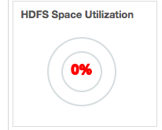
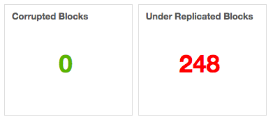
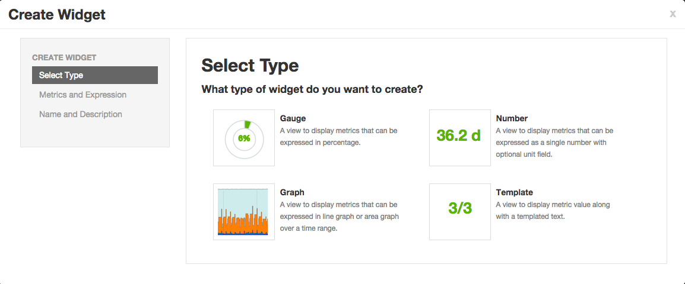

# Enhanced Service Dashboard

This feature was first introduced in Ambari 2.1.0 release. Any Ambari release before 2.1.0 does not support this feature. Cluster is required to be upgraded to Ambari 2.1.0 or above to use this feature.

:::caution
This document assumes that the service metrics are being exposed via Ambari. If this is not the case then please refer to [Metrics](https://cwiki.apache.org/confluence/display/AMBARI/Metrics)document for more related information.
:::

## Introduction

The term Enhanced Service Dashboard is used for being able to seamlessly add new widgets to the service summary page and heatmap page. This feature enables stack service to be packaged with the widget definitions in the JSON format. These widget definitions will appear as default widgets on the service summary page and heatmap page on service installation. In addition new widgets for the service can be created any time on the deployed cluster.

Displaying default service dashboard widgets on service installation is a 3 step process:

1. Push service metrics to Ambari Metric Collector.

2. Declare service metrics in service's metrics.json file of Ambari. This step is required to expose metrics via Ambari RESTful API.

3. Define service widgets in the widgets.jsonfile.

:::tip
Widget gets the data to be charted from the service metrics. It is important to validate that the required service metrics are being exposed from Ambari metrics endpoint before defining a widget.
:::

## Service Dashboard Widgets

Ambari supports 4 widget types:

1. Graph
2. Gauge
3. Number
4. Template

### Graph

A widget to display line or area graphs that are derived from one or more than one service metrics value over a range of time.


### Graph Widget Definition

```json
{
 "widget_name": "Memory Utilization",
 "description": "Percentage of total memory allocated to containers running in the cluster.",
 "widget_type": "GRAPH",
 "is_visible": true,
 "metrics": [
   {
     "name": "yarn.QueueMetrics.Queue=root.AllocatedMB",
     "metric_path": "metrics/yarn/Queue/root/AllocatedMB",
     "service_name": "YARN",
     "component_name": "RESOURCEMANAGER",
     "host_component_criteria": "host_components/HostRoles/ha_state=ACTIVE"
   },
   {
     "name": "yarn.QueueMetrics.Queue=root.AvailableMB",
     "metric_path": "metrics/yarn/Queue/root/AvailableMB",
     "service_name": "YARN",
     "component_name": "RESOURCEMANAGER",
     "host_component_criteria": "host_components/HostRoles/ha_state=ACTIVE"
   }
 ],
 "values": [
   {
     "name": "Memory Utilization",
     "value": "${(yarn.QueueMetrics.Queue=root.AllocatedMB / (yarn.QueueMetrics.Queue=root.AllocatedMB + yarn.QueueMetrics.Queue=root.AvailableMB)) * 100}"
   }
 ],
 "properties": {
   "display_unit": "%",
   "graph_type": "LINE",
   "time_range": "1"
 }
}
```

1. **widget_name:** This is the name that will be displayed in the UI for the widget.

2. **description:**Description for the widget that will be displayed in the UI.

3. **widget_type:**This information is used by the widget to create the widget from the metric data.

4. **is_visible:** This boolean decides if the widget is shown on the service summary page by default or not.

5. **metrics:** This is an array that includes all metrics definitions comprising the widget.

6. **metrics/name:** Actual n ame of the metric as being pushed to the sink or emitted as JMX property by the service.

7. **metrics/metric_path** **:** This is the path to which above mentioned metrics/name is mapped in metrics.json file for the service. Metric value will be exposed in the metrics attribute of the service component or host component endpoint of the Ambari API at the same path.

8. **metrics/service_name:**Name of the service containing the component emitting the metric.

9. **metrics/component_name:**Name of the component emitting the metric.

10. **metrics/host_component_criteria:**This is an optional field. Presence of this field means that the metric is host component metric and not a service component metric. If a metric is intended to be queried on host component endpoint then the criteria for choosing the host component needs to be specified over here. If this is left as a single space string then the first found host component will be queried for the metric.

11. **values:** This is an array of datasets for the Graph widget. For other widget types this array always has one element.

12. **values/name:** This field is used only for Graph widget type. This shows up as a label name in the legend for the dataset shown in a Graph widget type.

13. **values/value:** This is the expression from which the value for the dataset is calculated. Expression contains references to the declared metric name and constant numbers which acts as valid operands. Expression also contains a valid set of operators {+,-,*,/} that can be used along with valid operands. Parentheses are also permitted in the expression.

14. **properties:** These contains set of properties specific to the widget type. For Graph widget type it contains display_unit, graph_type and time_range. t ime_range field is currently not honored in the UI.

### Gauge

A widget to display percentage calculated from current value of a metric or current values of more than one metric.


### Number

A widget to display a number optionally with a unit that can be calculated from the current value of a metric or current values of more than one metric.



### Template

A widget to display one or more numbers calculated from current value of a metric or current values of more than one metric along with the embedded string.

Aggregator function for the Metric

Aggregator function are related to only service component level metrics and are not supported for host component level metrics.

Ambari Metrics System supports 4 type of aggregation:

1. **max**: Maximum value of the metric across all host components
2. **min**: Minimum value of the metric across all host components
3. **avg**: Average value of the metric across all host components
4. **sum**: Sum of metric value recorded for each host components

By default Ambari Metrics System uses the average aggregator function while computing value for a service component metric but this behavior can be overridden by suffixing metric name with the aggregator function name (._max ,._min ,._avg and ._sum ).

```json
{
 "widget_name": "Blocked Updates",
 "description": "Number of milliseconds updates have been blocked so the memstore can be flushed.",
 "default_section_name": "HBASE_SUMMARY",
 "widget_type": "GRAPH",
 "is_visible": true,
 "metrics": [
   {
     "name": "regionserver.Server.updatesBlockedTime._sum",
     "metric_path": "metrics/hbase/regionserver/Server/updatesBlockedTime._sum",
     "service_name": "HBASE",
     "component_name": "HBASE_REGIONSERVER"
   }
 ],
 "values": [
   {
     "name": "Updates Blocked Time",
     "value": "${regionserver.Server.updatesBlockedTime._sum}"
   }
 ],
 "properties": {
   "display_unit": "ms",
   "graph_type": "LINE",
   "time_range": "1"
 }
}
```

## Widget Operations:

A Service that has widgets.json and metrics.json file will also be provided with following abilities:

1. **Widget Browser** for performing widget related operations.

2. **Create widget wizard** for creating new desired service widgets in a cluster.

3. **Edit widget wizard** for editing service widgets post creation.

## Widget Browser

Widget Browser is the place from which actions can be performed on widgets like adding/removing a widget from the dashboard, sharing widget with other users and deleting a widget.While creating new widget, user can choose to share the widget with other users or not. All widgets that are created by the user + shared with the user + defined in the stack as default service widgets will be available in the widget browser of a user.


### Create Widget Wizard

A custom desired widget can be created from the exposed service metrics using 3 step Create Widget wizard.


## Using Enhanced Service Dashboard feature

If the existing service in Ambari is pushing the metrics to Ambari metrics collector then minimal work needs to be done. This includes adding metrics.json and widgets.json file for the service, and might include making changes to metainfo.xml file.

:::tip
[AMBARI-9910](https://issues.apache.org/jira/browse/AMBARI-9910) added widgets to Accumulo service page. This work can be referred as an example to use Enhanced Service Dashboard feature.
:::