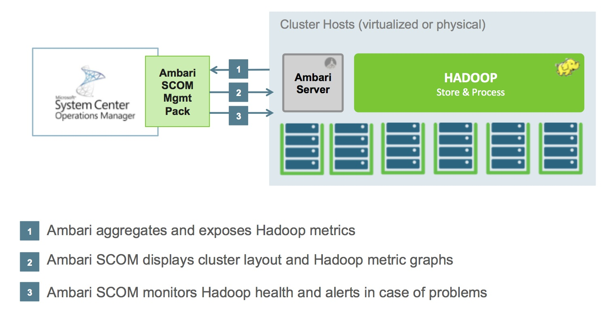

# Ambari SCOM Management Pack

This information is intended for **Apache Hadoop** and **Microsoft System Center Operations Manager** users who want to monitor their Hadoop clusters using the **Ambari SCOM Management Pack**.

## Introduction

The Ambari SCOM Management Pack extends the functionality of Microsoft System Center Operations Manager to monitor Apache Hadoop clusters. It leverages Ambari and the Ambari REST API to obtain Hadoop metrics and provide comprehensive monitoring capabilities.

### Compatibility

Ambari SCOM Management Pack is compatible with the following versions:

| Ambari SCOM Version | Compatible Ambari Server Versions | Notes |
|---------------------|-----------------------------------|-------|
| 3.0.0               | 3.0.0                            | Latest version with improved metrics collection |
| 2.0.0               | 1.5.1+                           | Legacy support |
| 1.0.0               | 1.4.4                            | Legacy support |

> **Note:** For the best experience, it's recommended to use matching versions of Ambari Server and the Ambari SCOM Management Pack.

### Source Code

The Ambari SCOM contribution can be found in the Apache Ambari project repository:

- [GitHub: apache/ambari/contrib/ambari-scom](https://github.com/apache/ambari/tree/trunk/contrib/ambari-scom)

## Features

The Ambari SCOM Management Pack provides the following key features:

- **Automatic Discovery**: Automatically discovers all nodes within Hadoop cluster(s)
- **Proactive Monitoring**: Continuously monitors the availability and capacity of your Hadoop services
- **Health Notifications**: Proactively notifies administrators when the health is critical
- **Intuitive Dashboards**: Efficiently visualizes the health of Hadoop clusters through comprehensive dashboards
- **Detailed Metrics**: Collects and displays detailed metrics for all Hadoop components

## Architecture

Ambari SCOM consists of the following components:

1. **Ambari Server**: Collects metrics from Hadoop clusters
2. **SCOM Management Server**: Processes and stores monitoring data
3. **SCOM Console**: Provides the user interface for monitoring and alerts
4. **Ambari SCOM Management Pack**: Connects Ambari with SCOM and defines monitoring rules

## Getting Started

To get started with the Ambari SCOM Management Pack:

1. Ensure you have a functioning Ambari Server (version 3.0.0 or compatible)
2. Install Microsoft System Center Operations Manager
3. Follow the [Installation Guide](./installation) to install the management pack
4. Configure the necessary Run As accounts and discovery rules

## Additional Resources

The following links provide information about common tasks associated with System Center Management Packs:

- [Administering the Management Pack Life Cycle](http://go.microsoft.com/fwlink/?LinkId=211463)
- [How to Import a Management Pack in Operations Manager](http://go.microsoft.com/fwlink/?LinkID=142351)
- [How to Monitor Using Overrides](http://go.microsoft.com/fwlink/?LinkID=117777)
- [How to Create a Run As Account in Operations Manager](http://technet.microsoft.com/en-us/library/hh321655.aspx)
- [Microsoft System Center Documentation](https://docs.microsoft.com/en-us/system-center/scom/)

For questions about Operations Manager and monitoring packs, visit the [Microsoft Q&A for System Center](https://docs.microsoft.com/en-us/answers/topics/system-center-operations-manager.html) or the [System Center blog](https://techcommunity.microsoft.com/t5/system-center-blog/bg-p/SystemCenterBlog).
