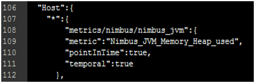
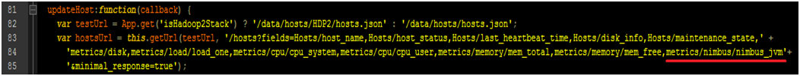
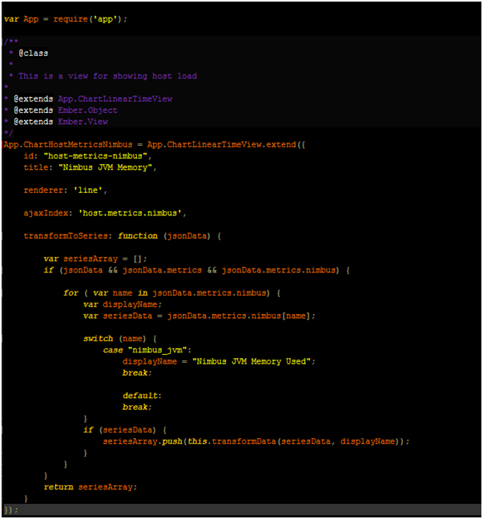
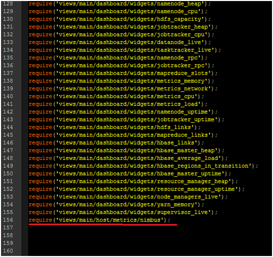
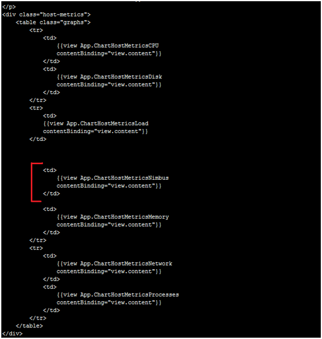
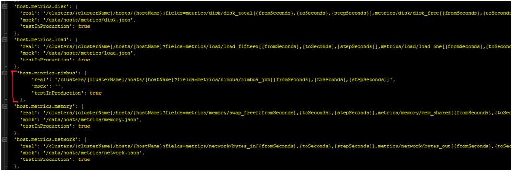

# Step-by-step guide on adding a dashboard widget for a host.

## Create your own dashboard widget for hosts:

Requirements:

- Jmxtrans
    - Jmxtrans is the application chosen to compile rrd files in order to produce graphing data on ganglia.
https://github.com/jmxtrans/jmxtrans
- .rrd files
    - All the Ganglia rrd files are stored in the /var/lib/rrds directory on the host machine where the Ganglia server is installed.
    - In this example I’ll be using the “**Nimbus_JVM_Memory_Heap_used.rrd**” file for the data of my custom widget.

**Step 1**:

First we need to go add the rrd file in the “**ganglia_properties.json**” file which is located in the `ambari\ambari-server\src\main\resources` directory of your Ambari source code. This is necessary so that the Ambari-server can call your rrd file from Ganglia via the Ambari API.

Line 108: Create the path for the metrics to be included in the API.

Line 109: Specify the rrd file.

**Step 2**:

Now we are going to add the API path created in step 1 at line 108, to the “**update_controller.js**” file located in the `ambari\ambari-web\app\controllers\global` directory, so that our graph data can be updated frequently.

**Step 3**:

Create a JavaScript file for the view of the template of our custom widget and save it in the `ambari\ambari-web\app\views\main\host\metrics` directory of your Ambari source code. In this case I saved my file as “**nimbus.js**”

**Step 4**:

Add the JavaScript file you created in the previous step into the “**views.js**” file located in the `ambari\ambari-web\app` directory.

**Step 5**:

Add the .js file view created in step 3 in the “**metrics.hbs**” template file located in the `ambari\ambari-web\app\templates\main\host` directory.

**Step 6**:

Add the API call to the “**ajax.js**” file located in the `ambari\ambari-web\app\utils` directory.

